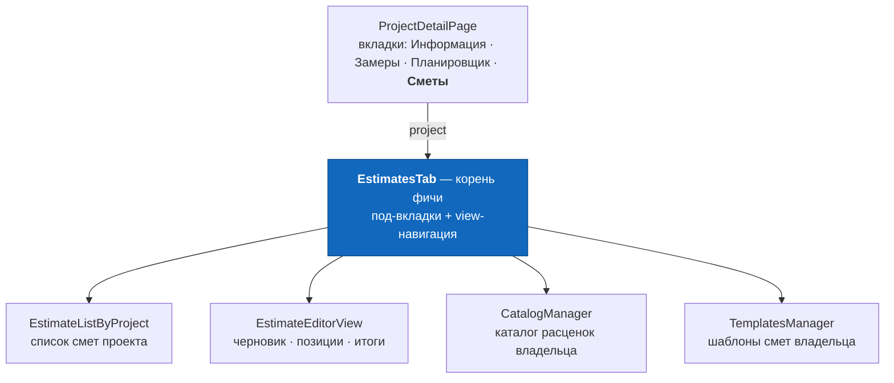
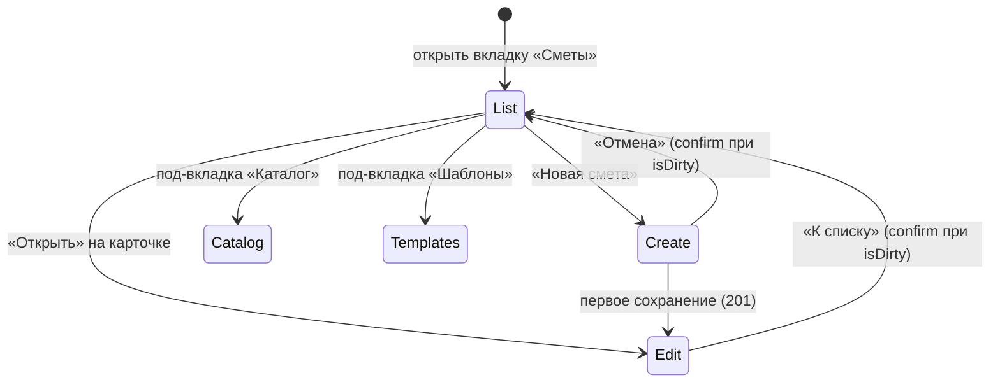
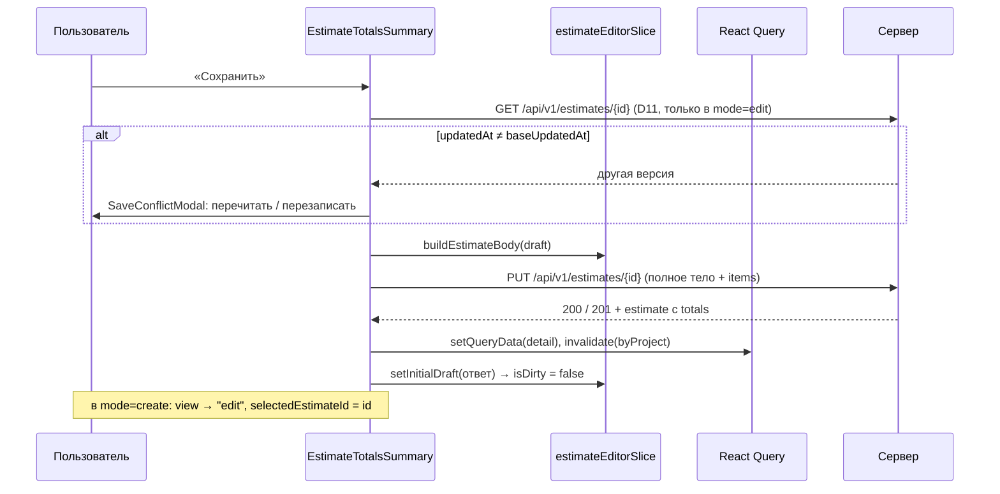

# DESIGN — Смета на вебе (estimate)

**Дата:** 12 августа 2026
**Область:** `web/` — React-клиент фичи «составление сметы»
**Вход:** [`RECEARCH_ESTIMATE.md`](./RECEARCH_ESTIMATE.md) (карта кода, контракт, находки F-1…F-12)
**Образец UX:** функционал `offer` в `/Users/alex/Desktop/apps/fuenex/home_build_client`
(`src/components/offers/*`, `src/features/offers/*`, `src/features/offers/agentic_docs/DESIGN_OFFERS.md`)
**Бекенд:** готов, менять не требуется

---

## 0. Ключевые решения (TL;DR)

| № | Решение | Почему |
|---|---|---|
| **D1** | Вкладка «Сметы» рендерит `<EstimatesTab project={project} />` вместо `ComingSoonTab` — **единственная правка в `ProjectDetailPage.tsx`** | образец устроен так же: внешняя вкладка проекта → один компонент фичи |
| **D2** | Внутри вкладки — три под-вкладки: **Сметы · Каталог · Шаблоны**, и навигация `view: "list" \| "create" \| "edit"` локальным стейтом | дословно `OffersTab` (`Angebote · Artikel · Texte` + `view`) |
| **D3** | Черновик редактора — **RTK-слайс `estimateEditorSlice`**, один на приложение | образец (`offerEditorSlice`) + `CONVENTIONS.md`: RQ по умолчанию, RTK — для сложного UI-состояния; три соседних компонента читают один черновик |
| **D4** | Сохранение — **явная кнопка «Сохранить»**, `disabled={!isDirty}`, предупреждение при уходе | образец; автосохранение отвергнуто (F-1: каждый `PUT` — полная замена дерева) |
| **D5** | Числовые поля — **строковый буфер + коммит по `onBlur`**, откат на прежнее значение при мусоре | `OfferLineItemsTable`: `qtys/purchases/prices` — `Record<id, string>` |
| **D6** | Таблица позиций — **`<table>` на `d-none d-lg-table` + карточки на `d-lg-none`** | образец; единственная его часть на чистом Bootstrap, переносится почти дословно |
| **D7** | Закупка и маржа — за переключателем «Показать закупку», **выключен по умолчанию** | `showInternalCols` из образца; отвечает на вопрос 7 research (коммерческая тайна) |
| **D8** | Порядок позиций — стрелки ↑/↓, `position` пересчитывается `0…n−1` перед отправкой | образец (`reorderLineItemsLocal`); DnD — лишняя зависимость и боль на мобильном |
| **D9** | Деньги — **целые минорные единицы** во всём состоянии; major только на вводе и выводе | `DESIGN_ESTIMATE §6.2`; расхождение с образцом, где деньги — `float` евро |
| **D10** | Итоги считает клиент (`totals.ts`) для отклика; после сохранения истина — ответ сервера | `DESIGN_ESTIMATE §6.3`; порядок округления обязан совпасть (F-4) |
| **D11** | Перед `PUT` — контрольный `GET`; если `updatedAt` изменился, спросить «перечитать или перезаписать» | у нас нет `expectedUpdatedAt`/`409` образца (F-3). Сужает окно, не закрывает — цена честно названа в §11.3 |
| **D12** | Выборщик из каталога — **множественный выбор, дубли разрешены** | расхождение с образцом (там `alreadyAdded` блокирует повтор): у нас позиция — снимок, одна расценка законно встречается дважды |
| **D13** | Шаблоны в обе стороны: «Применить шаблон» и «Сохранить смету как шаблон» | обратная операция стоит один `PUT`, данные те же |
| **D14** | Файлы: логика в `src/features/estimates/`, компоненты в `src/components/estimates/`, модалки в `src/components/modals/` | так требует `web/agentic_docs/CONVENTIONS.md` и так устроен образец (F-8) |
| **D15** | Экспорта (PDF/Excel), статусов сметы, разделов и тегов в этой фиче **нет** | `DESIGN_ESTIMATE §12`: экспорт не решён, разделы и теги закрыты отказом; статусов у сметы нет в схеме |

---

## 1. Точка входа

Единственная правка в существующем коде проекта — замена заглушки:

```
web/src/features/projects/pages/ProjectDetailPage.tsx:143–145

- {activeTab === "estimate" && (
-   <ComingSoonTab text="Раздел «Сметы» появится вместе с фичей сметы." />
- )}
+ {activeTab === "estimate" && <EstimatesTab project={project} />}
```

`project` уже есть в области видимости (`useGetProject(id)`), `projectId` нужен для списка смет
и для тела `PUT`. Ни маршруты (`App.tsx`), ни `Navbar` не трогаются (§15, вопрос 1).



---

## 2. Что берём из образца и что осознанно меняем

| Аспект | `offer` (образец) | Смета (здесь) | Причина расхождения |
|---|---|---|---|
| UI-кит | MUI + Bootstrap вперемешку | **только ванильный Bootstrap** + `bootstrap-icons` | `CONVENTIONS.md`; MUI в проекте нет и не ставится |
| Модалки | `<Dialog>` MUI | `modal-backdrop` + `modal d-block` руками | JS-бандла Bootstrap нет; готовый приём — `ProjectFormModal.tsx:106` |
| Подтверждения | `confirm()` / `alert()` | модалки по образцу `DeleteProjectModal` | нативный `confirm` уже отвергнут в этом репозитории |
| Черновик | `offerEditorSlice` (RTK) | `estimateEditorSlice` (RTK) — **та же форма** | — |
| Реконсиляция id | `persistedLineItemIds` + `id: null` для новых | **не нужна вовсе** | id чеканит клиент (UUIDv7), `PUT` заменяет набор целиком |
| Конкурентность | `expectedUpdatedAt` → `409` на сервере | контрольный `GET` перед `PUT` (D11) | сервер SNG не умеет `If-Match` (F-3) |
| Деньги | `float` €, НДС `netto * 1.19` в коде | целые минорные единицы, `taxRateBp`/`discountBp` из сметы | `DESIGN_ESTIMATE §6.2`; ставка — снимок, а не константа |
| Позиция | ссылка `articleId` + `groupName` + `multi` + `minutes` | снимок: `title/description/unit/quantity/2 цены/position` | `DESIGN_ESTIMATE §7` (снимок), решение 11 (разделов нет) |
| Разделы | группировка по `groupName` с подсуммами | **плоский список + поиск по позициям** | решение 11: колонки `group` в схеме нет |
| Создание | отдельный `POST` с `items[{articleId, quantity}]` | тот же `PUT`, что и правка | глаголов три, `POST` нет |
| Каталог | `ArticlesManager` во внутренней вкладке | `CatalogManager` — так же | владельческие данные под проектным путём — цена принята (§15, вопрос 2) |
| Тексты Vor/Nach | `TextsManager` + шаблоны текстов | **нет**; вместо них — шаблоны смет | у сметы одно поле `note`; текстовых шаблонов в схеме нет |
| PDF | генерация, просмотр, удаление, BFF | **нет** | `DESIGN_ESTIMATE §12.2`: форма экспорта не решена |
| Статусы | `OFFEN/VERSENDET/…` + смена из списка | **нет** | у сметы нет колонки статуса |

**Что переносится почти дословно:** двухслойная таблица позиций (`d-lg-table` / `d-lg-none`),
буферы числовых полей с коммитом по `blur`, переключатель внутренних колонок, стрелки порядка,
`view`-навигация внутри вкладки, панель итогов с кнопкой сохранения справа, empty-state со
встроенной кнопкой создания.

---

## 3. Навигация внутри вкладки



Состояние — в `EstimatesTab`: `subTab: "estimates" | "catalog" | "templates"`,
`view: "list" | "create" | "edit"`, `selectedEstimateId: string | null`.
`create` и `edit` рендерят **один и тот же** `EstimateEditorView` с `mode`; в `create` он не
делает `GET`, а строит черновик локально (`buildDraftEstimate`) — как `CreateOfferView` в образце.

**Смена под-вкладки при `isDirty` запрещена без подтверждения** — иначе черновик умирает молча.

---

## 4. Карта компонентов и файлов

```
src/features/estimates/                     ← логика фичи
├── estimates.api.ts        # apiFetch-обёртки: list/get/put/patch/remove
├── estimates.hooks.ts      # useQuery/useMutation + ключи кэша + инвалидация
├── catalog.api.ts          # каталог: list/get/put/patch/remove
├── catalog.hooks.ts
├── templates.api.ts        # шаблоны: list/get/put/patch/remove
├── templates.hooks.ts
├── estimateEditorSlice.ts  # черновик сметы (§5)
├── estimateEditorSlice.test.ts
├── types.ts                # wire-типы + лимиты полей (RECEARCH §4, §5)
├── constants.ts            # CURRENCIES, DEFAULT_CURRENCY_KEY, MINOR_MULTIPLIER
└── utils/
    ├── totals.ts           # клиентская реализация формулы (§7)
    ├── totals.test.ts      # паритет по фикстурам сервера + построчное округление
    ├── money.ts            # parseMoneyToMinor / formatMinor
    ├── money.test.ts
    ├── buildEstimateBody.ts# черновик → тело PUT (позиции, position 0…n−1)
    └── fromCatalog.ts      # строка каталога / позиция шаблона → позиция сметы (новый UUIDv7)

src/components/estimates/                   ← .tsx фичи
├── EstimatesTab.tsx            # корень: под-вкладки + view
├── EstimateListByProject.tsx   # список смет проекта (карточки)
├── EstimateEditorView.tsx      # редактор: create | edit
├── EstimateHeader.tsx          # title, currency, taxRateBp, discountBp, note
├── EstimateItemsTable.tsx      # позиции: таблица (lg+) / карточки (<lg)
├── EstimateTotalsSummary.tsx   # итоги + «Сохранить» + «Сохранить как шаблон»
├── CatalogManager.tsx          # каталог: поиск, избранное, категории, CRUD
└── TemplatesManager.tsx        # шаблоны: список + редактор + удаление

src/components/modals/                      ← модалки (CONVENTIONS.md)
├── SelectCatalogItemsModal.tsx # выбор позиций каталога → в черновик (множественный)
├── ApplyTemplateModal.tsx      # выбор шаблона → копия позиций в черновик
├── SaveAsTemplateModal.tsx     # черновик → новый шаблон
├── EditEstimateItemModal.tsx   # длинные поля позиции: title, description, unit
├── CatalogItemFormModal.tsx    # создание/правка строки каталога
├── DeleteEstimateModal.tsx     # подтверждение удаления сметы
└── SaveConflictModal.tsx       # D11: «смета изменилась в другом окне»
```

Трогаем существующее: `ProjectDetailPage.tsx` (§1) и `src/app/store.ts` (регистрация слайса
в `combineSlices`). Больше ничего.

---

## 5. Состояние редактора (`estimateEditorSlice`)

```ts
type EstimateDraft = {
  id: string            // UUIDv7: в create чеканится сразу, до первого PUT
  projectId: string
  title: string
  currency: string
  taxRateBp: number
  discountBp: number
  note: string
  items: DraftItem[]    // порядок массива и есть порядок позиций
}

type DraftItem = {
  id: string            // UUIDv7, чеканится при добавлении
  title: string
  description: string
  unit: string
  quantity: number
  purchasePriceMinor: number
  sellingPriceMinor: number
}

type EstimateEditorState = {
  draft: EstimateDraft | null
  baseUpdatedAt: string | null   // updatedAt последней серверной версии — для D11
  isDirty: boolean
  showPurchase: boolean          // D7, переживает переключение позиций
}
```

**`position` в состоянии не хранится** — его роль играет индекс массива, а в тело `PUT` он
попадает как `index` при сборке (`buildEstimateBody`). Образец держит `ordinalNumberInTable`
полем и пересчитывает его в двух местах; индекс массива не расходится с порядком по построению.

Actions: `setInitialDraft(estimate)` · `startNewDraft({projectId, currency})` ·
`updateScalar({field, value})` · `addItems(DraftItem[])` · `updateItem({id, patch})` ·
`removeItem(id)` · `moveItem({from, to})` · `toggleShowPurchase()` · `resetEditor()`.

Selectors: `selectDraft` · `selectIsDirty` · `selectShowPurchase` · `selectBaseUpdatedAt` ·
`selectDraftTotals` (мемоизированный вызов `computeTotals`, §7).

Жизненный цикл — как в образце: `setInitialDraft` в `useEffect` при получении данных,
`resetEditor` в cleanup того же эффекта. После успешного `PUT` ответ сервера кладётся обратно
через `setInitialDraft(updated)` — `isDirty` сбрасывается, `baseUpdatedAt` обновляется.

**Отвергнуто: `useReducer` + Context вместо слайса.** Даёт тот же доступ без prop-drilling и
умирает вместе с редактором, но `CONVENTIONS.md` называет два инструмента — React Query и RTK, —
а образец решает ровно эту задачу слайсом. Заводить третий механизм ради экономии одной строки
в `store.ts` — усложнение без выигрыша.

---

## 6. Чтение и сохранение

### 6.1 Ключи кэша и инвалидация

| Ключ | Что | Инвалидация |
|---|---|---|
| `["estimates", "byProject", projectId]` | список смет проекта (`EstimateSummary[]`) | после `PUT`, `DELETE` |
| `["estimates", "detail", id]` | смета с позициями и итогами | `setQueryData` ответом `PUT`; `removeQueries` после `DELETE` |
| `["catalog-items"]` | весь каталог владельца | после любого `PUT`/`DELETE` каталога |
| `["estimate-templates"]` | список шаблонов | после `PUT`/`DELETE` шаблона |
| `["estimate-templates", "detail", id]` | шаблон с позициями | так же |

Каталог префетчится при монтировании `EstimatesTab` (`useGetCatalog()` без использования
результата) — к моменту открытия выборщика он уже в кэше. Приём взят из образца
(`OffersTab.tsx:26`).

### 6.2 Поток сохранения



### 6.3 Тело `PUT` (`buildEstimateBody`)

```ts
{
  projectId, title, currency, taxRateBp, discountBp, note,
  items: draft.items.map((it, index) => ({ ...it, position: index }))
}
```

Ключ `items` присутствует **всегда**, даже пустым массивом — сознательно и по той же причине,
по которой он опасен (F-2): смета без позиций это `items: []`, и другого способа её выразить нет.
Отдельной ветки «если пусто — не слать ключ» быть не должно ни при каких обстоятельствах.

**Скаляры через `PATCH`.** Правка только `title`/`currency`/`taxRateBp`/`discountBp`/`note`
без единого касания позиций отправляется как `PATCH` — он дешевле и не трогает поддерево
(`RECEARCH §3.2`). Условие: `isDirty` по скалярам есть, по `items` — нет. Флаг
`itemsDirty` в слайсе ведётся отдельно от общего `isDirty` ровно ради этой развилки.

---

## 7. Деньги

### 7.1 Хранение и ввод

Во всём состоянии и во всех пропсах деньги — **целые минорные единицы** (`…Minor: number`).
Major-представление существует ровно в двух точках: поле ввода и вывод на экран.

```ts
// money.ts
export const MINOR = 100  // DESIGN_ESTIMATE §6.2: у всех валют СНГ два знака

// "1 234,56" | "1234.5" | "1234" → 123456 | null (мусор)
export const parseMoneyToMinor = (raw: string): number | null

// 123456, "RUB" → "1 234,56 ₽"
export const formatMinor = (minor: number, currency: string): string =>
  new Intl.NumberFormat("ru-RU", { style: "currency", currency }).format(minor / MINOR)
```

`parseMoneyToMinor` режет пробелы и ` `, принимает запятую и точку, требует
`^\d+([.,]\d{0,2})?$`. **Третий знак после запятой — ошибка ввода, а не повод округлить**: цена
уходит на сервер целым числом, дробное значение — `400` (`DESIGN_ESTIMATE §11`).

Поля ввода — `type="text" inputMode="decimal"`, а не `type="number"`: образец использует
`type="number"` и получает вместе с ним `1e5`, локальные разделители браузера и колесо мыши,
меняющее цену при скролле страницы.

### 7.2 Клиентская формула (`totals.ts`)

```ts
const roundBp = (amount: number, bp: number): number => {
  const n = amount * bp            // amount ≥ 0, bp ∈ [0,10000] — знаков не бывает
  const q = Math.floor(n / 10000)
  return (n - q * 10000) * 2 >= 10000 ? q + 1 : q
}

export const computeTotals = (items, taxRateBp, discountBp): EstimateTotals => {
  // ШАГ 1 — округление НА КАЖДОЙ позиции, затем сумма (F-4)
  const costMinor = items.reduce((s, i) => s + Math.round(i.quantity * i.purchasePriceMinor), 0)
  const netMinor  = items.reduce((s, i) => s + Math.round(i.quantity * i.sellingPriceMinor), 0)
  // ШАГ 2 — проценты над готовыми суммами
  const discountMinor         = roundBp(netMinor, discountBp)
  const netAfterDiscountMinor = netMinor - discountMinor
  const taxMinor              = roundBp(netAfterDiscountMinor, taxRateBp)
  return {
    costMinor, netMinor, discountMinor, netAfterDiscountMinor, taxMinor,
    grossMinor:  netAfterDiscountMinor + taxMinor,
    marginMinor: netAfterDiscountMinor - costMinor,
  }
}
```

Три требования, нарушение любого из которых даёт расхождение с сервером:

1. **`Σ round(…)`, а не `round(Σ …)`** — сервер округляет каждую строку в SQL
   (`repository/sqlite/estimate.go:354`).
2. **Скидка до налога, маржа после скидки, налог вне маржи** — порядок из
   `service/estimate.go:70`.
3. **Всё в целых.** `Math.round` в JS округляет половину вверх, SQLite `ROUND` — от нуля; суммы
   здесь всегда ≥ 0, поэтому поведения совпадают. Отрицательной может быть только `marginMinor`,
   а она получается вычитанием и не округляется.

Сумма строки на экране — `Math.round(quantity × sellingPriceMinor)`, то самое число, которое
уходит в `netMinor`. Пользователь складывает колонку глазами и обязан получить итог.

### 7.3 Кто источник истины

- **Пока черновик не сохранён** — клиентские числа: сервер о правках не знает.
- **После `PUT`** — `totals` из ответа кладутся в кэш и показываются вместо расчётных.
- **В списке смет** — только серверные `totals` (`GET /projects/{id}/estimates` их уже отдаёт),
  клиентская формула там не вызывается вовсе.

Расхождение расчётного и серверного итога после сохранения — **баг клиента**, а не повод
показать оба числа.

---

## 8. Редактор

### 8.1 Шапка (`EstimateHeader`)

Карточка `card shadow-sm`, `row g-3`:

| Поле | Контрол | Ограничение |
|---|---|---|
| `title` | `input`, `maxLength=256` | пустое допустимо, но в списке покажется «Без названия» |
| `currency` | `select` из `CURRENCIES` (`RUB KZT UZS UAH BYN AMD GEL KGS TJS AZN`) | смена валюты **не пересчитывает** цены — она их переименовывает (§15, вопрос 4) |
| `taxRateBp` | `input` в процентах, `0…100`, шаг `0.01` → `× 100` в bp | `2000` bp = «20 %» на экране |
| `discountBp` | так же | |
| `note` | `textarea`, `maxLength=512` | |

Коммит — по `onBlur`, как в `OfferHeader`. Ставка и скидка правятся часто и в одиночку —
это и есть основной поставщик `PATCH`-сохранений (§6.3).

### 8.2 Таблица позиций (`EstimateItemsTable`)

**Десктоп (`d-none d-lg-table`)** — колонки:

```
№↑↓ │ Наименование + описание │ Ед. │ Кол-во │ [Закупка] │ Продажа │ [Маржа] │ Сумма │ 🗑
```

Колонки в скобках показываются переключателем «Показать закупку» (D7). Маржа строки —
`round(q × sell) − round(q × purchase)`, справочная.

**Мобильный (`d-lg-none`)** — карточка на позицию: заголовок + описание сверху, действия
справа, поля `Кол-во | Закупка | Продажа` в `row g-2`, сумма строки в подвале с `border-top`.
Раскладка взята из `OfferLineItemsTable.tsx:341–423`.

Поведение полей (`D5`, из образца):

```ts
const [qty, setQty] = useState<Record<string, string>>({})   // буфер по id
onChange → пишем в буфер (валидации нет, пользователь печатает)
onBlur   → парсим; мусор или вне диапазона → откат буфера к значению из черновика
         → корректное и изменившееся → dispatch(updateItem(...))
```

Диапазоны при коммите: `quantity ∈ [0, 1 000 000]`, цены `∈ [0, 10¹¹]` минорных.

Прочее:

- **Добавление** — кнопка «Из каталога» (модалка D12) и «Пустая строка» (позиция с пустыми
  полями, заполняется на месте). У образца второго варианта нет — там позиция обязана
  происходить из артикула; у нас снимок, происхождение не хранится.
- **Длинные поля** (`title`, `description`, `unit`) правятся в `EditEstimateItemModal` —
  в таблице они только показываются. Образец делает так же для `description`.
- **Порядок** — стрелки ↑/↓, крайние заблокированы.
- **Удаление** — иконка корзины, подтверждение модалкой при непустой позиции.
- **Поиск по позициям** — поле над таблицей, фильтрует отображение по `title`/`description`;
  на черновик не влияет. Это замена разделам (решение 11, `DESIGN_ESTIMATE §5.4`).
- **Счётчик `n / 1000`** появляется от 900 позиций; кнопки добавления гаснут на 1000.

### 8.3 Панель итогов (`EstimateTotalsSummary`)

Семь строк в порядке формулы, каждая — `row` с подписью слева и моноширинной суммой справа:

```
Себестоимость   559 800 ₽     ← только при showPurchase
Нетто           995 200 ₽
Скидка 5 %      −49 760 ₽     ← строка скрыта при discountBp = 0
К оплате нетто  945 440 ₽
НДС 20 %        189 088 ₽     ← строка скрыта при taxRateBp = 0
─────────────────────────
ИТОГО брутто  1 134 528 ₽     ← крупно, bg-light
Маржа           385 640 ₽     ← только при showPurchase; отрицательная — text-danger
```

Действия панели: «Сохранить» (справа, `disabled={!isDirty || isPending}`),
«Сохранить как шаблон», «Применить шаблон». На `<lg` панель прилипает к низу
(`position-sticky bottom-0`) — сумма нужна во время правки, а не после скролла.

---

## 9. Каталог (`CatalogManager`)

Владельческий список до 5000 строк, приходит целиком одним запросом; поиск, сортировка и
группировка — на клиенте (F-6).

- Поле поиска (`title`, `description`, `category`), фильтр по категории (`select`,
  собирается из данных), чекбокс «Только избранные».
- Порядок: избранные наверх, дальше как отдал сервер (`title, id`).
- Строка: наименование, описание, единица, категория, цены, ⭐ (мгновенный
  `PATCH {isFavorite}`), ✏️, 🗑.
- Раскладка — карточки на мобильном, таблица на `lg+` (как `ArticlesManager`).
- Создание/правка — `CatalogItemFormModal` (`PUT` c `uuidv7()` / `PATCH` диффом по образцу
  `ProjectFormModal.tsx:68–84`).
- На `400 catalog item limit reached` — «Каталог заполнен (5000 позиций)».
- От 500 строк список рендерится порциями по 100 с кнопкой «Показать ещё»: виртуализация —
  лишняя зависимость, а пагинация на клиенте стоит десять строк.

**Выборщик в смету (`SelectCatalogItemsModal`, D12):** тот же поиск и фильтры, чекбоксы,
поле «Кол-во» у выбранной строки (по умолчанию `1`), кнопка «Добавить N позиций». Копия по
значению: новый `uuidv7()`, `title/description/unit/цены` из каталога, `category` и
`isFavorite` **не переносятся** — их у позиции сметы нет.

---

## 10. Шаблоны (`TemplatesManager`)

- Список шаблонов (без позиций — сервер их в списке не отдаёт), карточка: название, заметка,
  ставка/скидка, кнопки «Открыть», «Удалить».
- Редактор шаблона — тот же `EstimateItemsTable` над черновиком шаблона: у позиции шаблона те
  же поля, у самого шаблона нет `currency`, `projectId` и итогов. Итоги в редакторе шаблона
  **не показываются**: шаблон без валюты — не документ с суммой.
- **«Применить шаблон»** (`ApplyTemplateModal`) из редактора сметы: `GET` шаблона → на каждую
  позицию новый `uuidv7()` → `addItems` в черновик. Ставку и скидку шаблона предлагаем
  применить отдельным чекбоксом (по умолчанию — да, если у сметы они нулевые).
- **«Сохранить как шаблон»** (`SaveAsTemplateModal`): название → `PUT /estimate-templates/{new}`
  с позициями черновика (новые id) и текущими ставкой/скидкой. Валюта не переносится.
- Позиции шаблона добавляются из того же каталожного выборщика.

Связи «эта смета сделана из того шаблона» не существует и не появится — снимок
(`DESIGN_ESTIMATE §7`).

---

## 11. Ошибки и граничные случаи

### 11.1 Коды

| Ситуация | Что показываем |
|---|---|
| `400 VALIDATION_ERROR` | сообщение сервера + подсветка поля. **Это баг клиента**: всё, что сервер проверяет, проверено до отправки (§12) |
| `404` при `GET` сметы | «Смета не найдена — возможно, удалена» + «К списку» (как `ProjectDetailPage:70–88`) |
| `404` при `PUT` | смета или проект удалены в другом окне: черновик **не теряем**, предлагаем «Сохранить как новую» (новый `uuidv7()`) |
| `413` | «Смета слишком большая — сократите описания позиций». Достижимо: 1000 позиций × 1000 рун описания > 1 МБ |
| `401` | обрабатывает `apiFetch` (refresh); при неудаче `ProtectedRoute` уводит на логин |
| сеть / `500` | «Не удалось сохранить. Черновик остался в редакторе» — `isDirty` не сбрасываем |

### 11.2 Пограничные состояния UI

| Случай | Поведение |
|---|---|
| у проекта нет смет | empty-state с иконкой и кнопкой «Создать первую смету» (образец, `OfferListByProject:101–113`) |
| смета без позиций | пустая таблица с кнопкой «Добавить из каталога»; итоги — нули, панель показывается |
| каталог пуст при открытии выборщика | «Каталог пуст» + кнопка «Создать расценку» (уводит на под-вкладку) |
| `quantity = 0` | допустимо (сервер разрешает), сумма строки — 0; строка помечается `text-muted` |
| выход из вкладки при `isDirty` | модалка «Черновик не сохранён» — как `unsavedConfirm` образца, но не нативный `confirm` |
| закрытие браузера при `isDirty` | `beforeunload` — единственное место, где остаётся нативный диалог |

### 11.3 Конкурентная правка — честная граница (D11)

Сервер SNG не отдаёт `rev` и не понимает `If-Match`, поэтому серверного `409` образца у нас
быть не может. Клиентский guard: перед `PUT` в режиме `edit` делаем `GET` и сравниваем
`updatedAt` с `baseUpdatedAt`. Разошлись → `SaveConflictModal`: «Перечитать» (потерять черновик)
или «Перезаписать» (потерять чужие правки).

**Что это НЕ даёт:** между контрольным `GET` и `PUT` остаётся окно в десятки миллисекунд.
Guard превращает «молча потерял смету» в «потерял смету, если попал в окно» — и это всё.
Настоящее решение — `If-Match` на сервере, и оно не в v1 (`DESIGN_PROJECT §8.4`).

---

## 12. Валидация на клиенте

Зеркало `RECEARCH §5`, лимиты — константой рядом с типами (`types.ts`), по образцу
`PROJECT_FIELD_LIMITS`:

```ts
export const ESTIMATE_LIMITS = {
  title: 256, note: 512, itemTitle: 256, itemDescription: 1000,
  itemUnit: 32, catalogCategory: 64,
  maxItems: 1000, maxCatalogItems: 5000,
  maxQuantity: 1_000_000, maxPriceMinor: 100_000_000_000, maxBp: 10_000,
} as const
```

- Длины считаются рунами: `Array.from(s).length` (`runeLength` из `ProjectFormModal.tsx:17`
  переезжает в `src/utils/`).
- `maxLength` на `input` + сообщение под полем при превышении.
- Валюта — `select`, произвольную строку ввести нельзя, поэтому `^[A-Z]{3}$` на клиенте
  проверять незачем.
- **Кнопка «Сохранить» не блокируется валидацией** — блокируется только `!isDirty` и
  `isPending`. Поля с ошибками подсвечиваются, но черновик остаётся отправляемым: запрет
  сохранения — верный способ заставить пользователя потерять работу.

---

## 13. Мобильный минимум и доступность

- Первое правило `CONVENTIONS.md` — mobile-first: раскладки описаны от узкого экрана вверх;
  таблица — прогрессивное улучшение для `lg+`, а не деградация вниз.
- Ни одного горизонтального скролла страницы: на `<lg` карточки, суммы моноширинным
  (`font-monospace`), обрезка длинных названий `text-break`.
- Кнопки действий в строке — не меньше 32 × 32 px.
- Все поля — с `<label>`, у иконочных кнопок `title` и `aria-label`.
- Модалки — `role="dialog" aria-modal="true"`, закрытие по Esc и по клику на подложку.
- Отрицательная маржа — `text-danger` **и** знак «−»: цвет один не носит смысла.

---

## 14. Тесты (vitest + RTL)

| Файл | Что проверяет |
|---|---|
| `utils/totals.test.ts` | **паритет**: все случаи `server_go/internal/service/testdata/estimate_totals_fixtures.json` + собственные кейсы построчного округления (F-4): дробное количество, `.5` минорной единицы на строке, сумма 1000 строк |
| `utils/money.test.ts` | `"1 234,56"`, `"1234.5"`, `"1234"`, `"12,345"` (→ null), `""`, `"-5"`, `"abc"` |
| `estimateEditorSlice.test.ts` | `isDirty` после каждого action; `itemsDirty` только при правке позиций; `moveItem` не теряет элементы; `resetEditor` |
| `utils/buildEstimateBody.test.ts` | `position` = индекс `0…n−1`; `items` присутствует при пустом списке |
| `EstimateItemsTable.test.tsx` | коммит по blur, откат мусора, переключатель закупки скрывает две колонки |

Фикстуры сервера копируются в `web/src/features/estimates/utils/__fixtures__/` **скриптом**
(`npm run sync:fixtures`), а не руками: копия, которую забыли обновить, хуже отсутствующей.

---

## 15. Решения по открытым вопросам research и что осталось открытым

| # | Вопрос `RECEARCH §10` | Решение |
|---|---|---|
| 1 | автосохранение или кнопка | **кнопка** (D4). Автосохранение при `PUT`-полной-замене и без `If-Match` — генератор гонок |
| 2 | маршрут редактора | **локальный стейт** как в образце. Цена названа: нет ссылки на смету, F5 возвращает в список. Апгрейд — `useSearchParams` (`?estimate=<id>`), две строки, делается при первой жалобе |
| 3 | где каталог и шаблоны | **под-вкладки внутри вкладки «Сметы»** (образец). Цена: владельческие данные живут под проектным путём, правка каталога из проекта А видна в Б — это верно, но неочевидно; подписываем в шапке каталога «Каталог доступен во всех проектах» |
| 4 | таблица на мобильном | **карточки** `d-lg-none` + таблица `d-lg-table` (D6) |
| 5 | `number` или `BigInt` | **`number`**: реальные суммы на десять порядков ниже `MAX_SAFE_INTEGER`. Предохранитель — валидация цены ≤ 10¹¹ и количества ≤ 10⁶ уже на вводе |
| 6 | `CONVENTIONS.md` или образец `projects` | **`CONVENTIONS.md` + образец `offer`** (D14): логика в `features/`, `.tsx` в `components/`, модалки в `components/modals/`. Долг: `features/projects/` привести к тому же виду отдельным коммитом |
| 7 | показывать ли себестоимость и маржу | **скрыты по умолчанию**, переключатель в таблице (D7), состояние — в слайсе, не в `localStorage`: экран, открытый заказчику, не должен помнить вчерашнее «показать» |

**Осталось открытым (на схему и на этот дизайн не влияет):**

1. **Экспорт сметы** (PDF/Excel) — `DESIGN_ESTIMATE §12.2`. У образца это половина панели
   итогов; у нас кнопки нет. Появится — встанет в `EstimateTotalsSummary` рядом с «Сохранить».
2. **Смена валюты у непустой сметы** — сейчас просто меняет подпись у тех же чисел.
   Предупреждение «цены не пересчитываются» показываем, конвертацию не делаем и не будем
   (`DESIGN_ESTIMATE §6.4`: курсов в системе нет).
3. **Дефолтная валюта нового пользователя** — `RUB`; дальше `localStorage` помнит последнюю
   (F-10). Кандидат на переезд в профиль, если пользователи окажутся не из РФ.
4. **Копирование сметы целиком** («эконом» → «премиум») — `GET` + новые id + `PUT`, три строки
   поверх готовых утилит. В v1 не входит, потому что не просили.

---

## 16. Что эта фича сознательно не делает

- не добавляет ни одного агрегата в список проектов (решение 10 `DESIGN_ESTIMATE §9.2`);
- не трогает `App.tsx`, `Navbar.tsx` и маршруты;
- не заводит статусы сметы, разделы позиций и теги каталога — их нет в схеме и не будет;
- не реализует офлайн, `/sync` и оптимистические обновления списка;
- не меняет ни строки на сервере.
