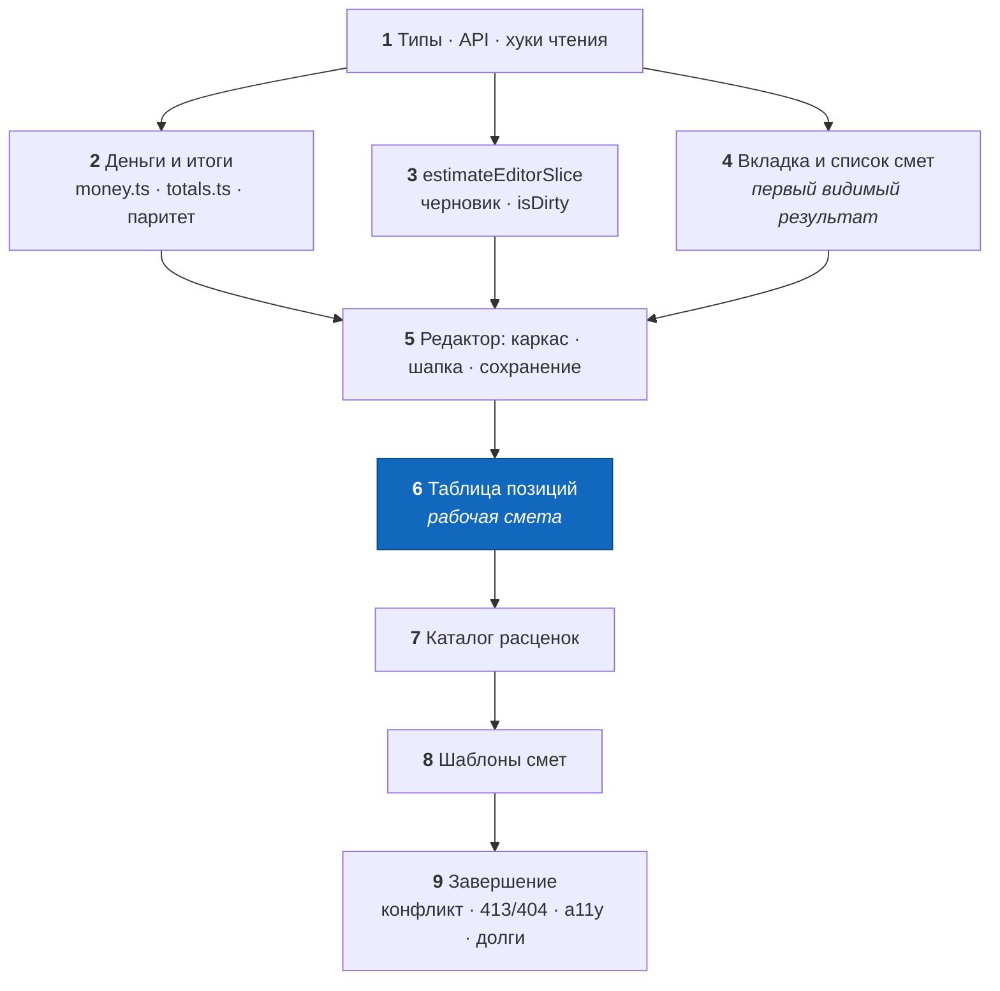

# PLANNING — Смета на вебе: пофазный план реализации

**Дата:** 12 августа 2026
**Область:** `web/` — клиентская часть фичи «составление сметы»
**Вход:** [`RECEARCH_ESTIMATE.md`](./RECEARCH_ESTIMATE.md) · [`DESIGN_ESTIMATE.md`](./DESIGN_ESTIMATE.md)
**Сервер:** готов и не меняется ни в одной фазе

---

## Принцип разбиения

Тот же, что в серверных планах этого продукта: каждая фаза — **отдельный завершённый коммит**,
после которого проект собирается, `type-check`, `lint` и `test` зелёные, а результат проверяется
руками в браузере. Если часть DESIGN попадает в фазу неполностью, это записано явно с указанием
закрывающей фазы.

Работа ведётся в ветке `feature/estimate` от `main`, по коммиту на фазу.

**Порядок фаз подчинён одному правилу: продукт должен быть полезен как можно раньше и оставаться
полезным, если работа остановится.** После фазы 6 бригадир составляет смету и видит итог — это
законченный продукт. Фазы 7–9 добавляют переиспользование между объектами и защиту от редких
сценариев; без них работает, со второго проекта раздражает.

---

## Инфраструктура — что уже есть

| Что | Где | Комментарий |
|---|---|---|
| Транспорт | `src/utils/api.ts` — `apiFetch<T>`, `ApiError`, авто-refresh, `204 → {}` | новых обёрток не заводим |
| Адрес API | `src/utils/apiConfig.ts` | не трогаем |
| UUIDv7 | `src/utils/uuid.ts` | обязателен: сервер отвергает v4 |
| Кэш | `@tanstack/react-query` 5.101, `QueryClient` в `src/main.tsx` (retry 1, без refetch on focus) | инвалидация явная |
| Стор | `@reduxjs/toolkit`, `combineSlices` в `src/app/store.ts` | сюда встанет `estimateEditorSlice` |
| Тесты | Vitest + RTL, `renderWithProviders` в `src/utils/test-utils.tsx`, `globals: true` | образец слайс-теста — `features/auth/authSlice.test.ts` |
| Стили | Bootstrap 5.3 CSS + `bootstrap-icons`, **без JS-бандла** | модалки строятся руками |
| Образец фичи | `src/features/projects/**` | приёмы: PUT c `uuidv7()`, PATCH диффом, модалки, скелетоны |

Команды: `npm run dev` · `npm run type-check` · `npm run lint` · `npm run format:check` ·
`npm run test` · `npm run build`.

**Локальная проверка руками** требует поднятого сервера:
`cd ../server_go && go run ./cmd/server` (порт 8089, прокси уже прописан в `vite.config.ts`),
зарегистрированного пользователя и хотя бы одного проекта.

---

## Definition of Done — для каждой фазы

- [ ] `npm run type-check` — чисто;
- [ ] `npm run lint` и `npm run format:check` — чисто;
- [ ] `npm run test` — зелёный;
- [ ] новый поведенческий код покрыт тестами фазы (где применимо);
- [ ] сценарий «проверка руками» из фазы пройден в браузере на **360 px и на десктопе**;
- [ ] один осмысленный коммит, ветка остаётся рабочей.

---

## Карта фаз

| Фаза | Содержание | Коммит |
|---|---|---|
| 1 | типы, `estimates.api.ts`, хуки чтения | `estimate: типы, api и хуки чтения` |
| 2 | `money.ts`, `totals.ts`, тесты паритета, синк фикстур | `estimate: деньги и итоги с тестом паритета` |
| 3 | `estimateEditorSlice` + тесты, регистрация в сторе | `estimate: слайс черновика редактора` |
| 4 | `EstimatesTab`, `EstimateListByProject`, удаление, правка `ProjectDetailPage` | `estimate: вкладка и список смет проекта` |
| 5 | редактор: каркас, шапка, `PUT`/`PATCH`, `isDirty` | `estimate: редактор сметы и сохранение` |
| 6 | таблица позиций (десктоп + мобайл), правка, порядок, удаление | `estimate: редактирование позиций` |
| 7 | каталог: менеджер, форма, выборщик в смету | `estimate: каталог расценок` |
| 8 | шаблоны: менеджер, применение, сохранение сметы как шаблона | `estimate: шаблоны смет` |
| 9 | guard конкурентной правки, обработка 413/404, a11y, вычитка | `estimate: завершение — конфликты, ошибки, доступность` |

**Граф зависимостей:** `1 → {2, 3, 4}`, `{2,3,4} → 5 → 6 → 7 → 8 → 9`.
Фазы 2, 3 и 4 после первой независимы и могут идти в любом порядке.

---

## Фаза 1 — Типы, API-слой, хуки чтения

**Цель:** зафиксировать клиентский контракт ровно по `RECEARCH §4` и дать остальным фазам
готовые запросы.

**Файлы (NEW):**
- `src/features/estimates/types.ts` — `Estimate`, `EstimateItem`, `EstimateTotals`,
  `EstimateSummary`, `EstimateInput`, `EstimateItemInput`, `EstimatePatch`, `CatalogItem`,
  `CatalogItemInput`, `CatalogItemPatch`, `EstimateTemplate`, `EstimateTemplateSummary`,
  `EstimateTemplateInput`, `ESTIMATE_LIMITS` (`DESIGN §12`);
- `src/features/estimates/constants.ts` — `CURRENCIES`, `DEFAULT_CURRENCY`, `MINOR`,
  `LAST_CURRENCY_STORAGE_KEY`;
- `src/features/estimates/estimates.api.ts` — `listByProject`, `getById`, `put`, `patch`, `remove`;
- `src/features/estimates/catalog.api.ts`, `templates.api.ts` — те же пять глаголов;
- `src/features/estimates/estimates.hooks.ts` — `ESTIMATES_QUERY_KEY`,
  `useGetEstimatesByProject(projectId)`, `useGetEstimate(id)`;
- `src/features/estimates/catalog.hooks.ts` — `useGetCatalog()`;
- `src/features/estimates/templates.hooks.ts` — `useGetTemplates()`, `useGetTemplate(id)`.

**Что делаем:**
- API-функции — тонкие обёртки над `apiFetch`, форма один в один с `projects.api.ts`;
- ключи кэша — из `DESIGN §6.1`;
- мутации в этой фазе **не пишем**: они появляются там, где их вызывают (фазы 4–8), иначе
  фаза кончается мёртвым кодом.

**Тесты:** нет (нет поведения).
**Проверка:** `npm run type-check && npm run lint`.
**Готово, когда:** типы компилируются, ни одного `any`, ни одного поля сверх контракта сервера.
**Риск:** соблазн добавить в типы `rev` или `ownerId` «на будущее» — сервер их не отдаёт,
поле будет вечно `undefined`.

---

## Фаза 2 — Деньги и итоги

**Цель:** единственное место, где живёт арифметика, и доказательство, что она совпадает с
сервером.

**Файлы (NEW):**
- `src/features/estimates/utils/money.ts` — `parseMoneyToMinor`, `formatMinor`, `MINOR`;
- `src/features/estimates/utils/money.test.ts`;
- `src/features/estimates/utils/totals.ts` — `roundBp`, `computeItemTotalMinor`, `computeTotals`;
- `src/features/estimates/utils/totals.test.ts`;
- `src/features/estimates/utils/__fixtures__/estimate_totals_fixtures.json` — **копия** серверного файла;
- `scripts/sync-estimate-fixtures.mjs` + скрипт `sync:fixtures` в `package.json`.

**Что делаем:**
- `computeTotals` строго по `DESIGN §7.2`: `Σ round(q × price)` на позициях, затем проценты;
- `roundBp` — целочисленный, half-up, без `toFixed` и без промежуточных float-делений;
- `parseMoneyToMinor`: пробелы и `nbsp` режутся, запятая = точка, `^\d+([.,]\d{0,2})?$`,
  иначе `null`.

**Тесты (обязательные, это ядро фазы):**
- все случаи из серверных фикстур — один в один по семи числам;
- **построчное округление, которого в фикстурах нет** (F-4): `quantity` 12.44 × 45000;
  количество, дающее ровно половину минорной единицы; 1000 строк по 0.5 (проверка, что
  `Σ round` ≠ `round Σ`);
- `money`: `"1 234,56"` → `123456`, `"1234.5"` → `123450`, `"1234"` → `123400`,
  `"12,345"` → `null`, `""` → `null`, `"-5"` → `null`, `"abc"` → `null`.

**Проверка руками:** `npm run test -- totals`.

**Про синк фикстур:** скрипт копирует
`../server_go/internal/service/testdata/estimate_totals_fixtures.json` в `__fixtures__/`.
**Копия коммитится**, в CI скрипт не запускается: `server_go` рядом лежит только на машине
разработчика, в Docker-сборке веба его нет.

**Готово, когда:** тест паритета зелёный, и падает, если поменять порядок скидки и налога.
**Риск:** соблазн посчитать `netMinor` как `round(Σ q × price)` — «так же короче». Это и есть
единственная ошибка, ради которой написана вся фаза.

---

## Фаза 3 — Слайс черновика

**Цель:** состояние редактора по `DESIGN §5` — до того, как появится сам редактор.

**Файлы (NEW):** `src/features/estimates/estimateEditorSlice.ts`, `…/estimateEditorSlice.test.ts`
**Файлы (CHANGED):** `src/app/store.ts` — слайс в `combineSlices`.

**Что делаем:**
- состояние: `draft | null`, `baseUpdatedAt`, `isDirty`, `itemsDirty`, `showPurchase`;
- actions по `DESIGN §5`; `position` в состоянии **не хранится** — порядок задаёт массив;
- `startNewDraft({projectId, currency})` чеканит `uuidv7()` сразу;
- `setInitialDraft` — глубокая копия, `isDirty = false`, `itemsDirty = false`,
  `baseUpdatedAt = updatedAt`;
- `updateScalar` поднимает только `isDirty`; всё, что трогает позиции, поднимает **оба** флага —
  на этой развилке фаза 5 выбирает `PATCH` или `PUT`.

**Тесты:**
- каждый мутационный редьюсер → `isDirty === true`;
- `updateScalar` → `itemsDirty` остаётся `false`;
- `addItems`/`removeItem`/`updateItem`/`moveItem` → `itemsDirty === true`;
- `moveItem` не теряет и не дублирует элементы, порядок соответствует ожидаемому;
- `setInitialDraft` и `resetEditor` сбрасывают оба флага;
- `selectDraftTotals` считает то же, что `computeTotals` напрямую.

**Проверка:** `npm run test -- estimateEditorSlice`.
**Готово, когда:** слайс-тест зелёный, `store.ts` собирается.
**Риск:** `showPurchase` внутри `draft` — тогда переключатель поднимет `isDirty` и предложит
сохранить смету, в которой ничего не изменилось. Флаг живёт рядом с черновиком, не внутри.

---

## Фаза 4 — Вкладка и список смет

**Цель:** первый видимый результат — вкладка «Сметы» перестаёт быть заглушкой.

**Файлы (NEW):**
- `src/components/estimates/EstimatesTab.tsx` — под-вкладки и `view`-навигация
  (вкладки «Каталог» и «Шаблоны» отрисованы, но выключены — включаются в фазах 7–8);
- `src/components/estimates/EstimateListByProject.tsx`;
- `src/components/modals/DeleteEstimateModal.tsx`.

**Файлы (CHANGED):**
- `src/features/projects/pages/ProjectDetailPage.tsx` — замена `ComingSoonTab` (`DESIGN §1`);
- `src/features/estimates/estimates.hooks.ts` — `useDeleteEstimate()`.

**Что делаем:**
- карточка сметы: название (или «Без названия»), валюта, `grossMinor` крупно, `netMinor` и
  «скидка N %» мелко, `updatedAt`, кнопки «Открыть» (пока заглушена) и «Удалить»;
- итоги берём **только из ответа сервера** — `computeTotals` в списке не вызывается;
- empty-state с кнопкой (в этой фазе она ведёт в никуда — включается в фазе 5, помечено `TODO`
  с номером фазы);
- скелетоны при загрузке и `alert-danger` при ошибке — как в `ProjectsPage.tsx:101–115`;
- удаление — модалка + `invalidate` списка.

**Тесты:** `EstimateListByProject.test.tsx` — три состояния (загрузка, пусто, список) и вызов
`onEdit` по клику.

**Проверка руками:** открыть проект → вкладка «Сметы» → пусто; создать смету через Swagger или
`curl` → в списке появилась с верной суммой; удалить → исчезла; повторить на 360 px.

**Готово, когда:** заглушки `ComingSoonTab` для сметы больше нет.
**Риск:** порядок списка задаёт сервер (`updated_at DESC`, F-5) — не пересортировывать на клиенте
«для стабильности», иначе после сохранения смета останется на месте вопреки серверу.

---

## Фаза 5 — Редактор: каркас, шапка, сохранение

**Цель:** смета создаётся, открывается и сохраняется. Позиции ещё только показываются.

**Файлы (NEW):**
- `src/components/estimates/EstimateEditorView.tsx` — `mode: "create" | "edit"`;
- `src/components/estimates/EstimateHeader.tsx`;
- `src/components/estimates/EstimateTotalsSummary.tsx`;
- `src/features/estimates/utils/buildEstimateBody.ts` + тест.

**Файлы (CHANGED):**
- `EstimatesTab.tsx` — `view`-переходы `list ↔ create ↔ edit`, подтверждение при `isDirty`;
- `estimates.hooks.ts` — `usePutEstimate()`, `usePatchEstimate()`.

**Что делаем:**
- `create`: `startNewDraft` с валютой из `localStorage` (иначе `DEFAULT_CURRENCY`), `GET` не
  делается; `edit`: `useGetEstimate` → `setInitialDraft`, `resetEditor` в cleanup;
- шапка по `DESIGN §8.1`, ставка и скидка вводятся в процентах, хранятся в bp;
- позиции показываются read-only списком (сумма строки считается `computeItemTotalMinor`);
- панель итогов по `DESIGN §8.3`, строки скидки и налога скрыты при нуле;
- сохранение: `itemsDirty` → `PUT` c полным телом; только скаляры → `PATCH`;
- после успеха: `setQueryData(detail)`, `invalidate(byProject)`, `setInitialDraft(ответ)`,
  в `create` — переход в `edit`; валюта запоминается в `localStorage`;
- ошибку показываем в панели, `isDirty` **не сбрасываем**.

**Тесты:**
- `buildEstimateBody`: `position` = `0…n−1`; ключ `items` присутствует при пустом списке;
- `EstimateEditorView.test.tsx`: правка названия делает кнопку активной; сохранение зовёт
  `PATCH` (не `PUT`), когда позиции не трогали.

**Проверка руками:** «Новая смета» → название, валюта, скидка 5 % → «Сохранить» → `201`, смета в
списке с нулевым итогом; F5 → открыть → правка заметки → «Сохранить» → в Network именно `PATCH`;
уйти к списку с несохранённым черновиком → предупреждение.

**Готово, когда:** смета создаётся и правится без единой позиции.
**Риск №1:** отправить `PUT` без ключа `items` — сотрёт позиции (F-2). Тест на пустой список
стоит в этой фазе именно поэтому.
**Риск №2:** в `create` вызвать `PATCH` — сметы ещё нет, ответ `404`. Первое сохранение всегда `PUT`.

---

## Фаза 6 — Таблица позиций

**Цель:** полноценная смета. После этой фазы продукт закончен.

**Файлы (NEW):**
- `src/components/estimates/EstimateItemsTable.tsx` — таблица `d-none d-lg-table` + карточки `d-lg-none`;
- `src/components/modals/EditEstimateItemModal.tsx` — `title`, `description`, `unit`.

**Что делаем (`DESIGN §8.2`):**
- буферы `Record<id, string>` для количества и двух цен, коммит по `onBlur`, откат мусора;
- поля — `type="text" inputMode="decimal"`, не `type="number"`;
- добавление пустой строки, удаление с подтверждением, порядок стрелками ↑/↓;
- переключатель «Показать закупку» открывает колонки закупки и маржи;
- поиск по позициям фильтрует отображение и не трогает черновик;
- счётчик `n / 1000` с 900 позиций, кнопка добавления гаснет на 1000;
- итоги пересчитываются на каждый коммит поля — отсюда весь смысл фазы 2.

**Тесты:** `EstimateItemsTable.test.tsx` — коммит по blur меняет итог; мусор откатывается и итог
не меняется; переключатель скрывает две колонки; стрелка ↑ у первой строки заблокирована.

**Проверка руками:** собрать смету из трёх позиций с дробным количеством → сверить итог с
`GET /estimates/{id}` после сохранения: **семь чисел совпадают до копейки**. Повторить на 360 px:
горизонтального скролла страницы нет.

**Готово, когда:** серверные и клиентские итоги совпадают на дробных количествах.
**Риск:** буфер, не синхронизированный после `setInitialDraft` (ответ сервера), покажет старые
цифры в полях. Пересев буферов — в `useEffect` по черновику, как в образце.

---

## Фаза 7 — Каталог расценок

**Цель:** переиспользование расценок между объектами.

**Файлы (NEW):**
- `src/components/estimates/CatalogManager.tsx`;
- `src/components/modals/CatalogItemFormModal.tsx`;
- `src/components/modals/SelectCatalogItemsModal.tsx`;
- `src/features/estimates/utils/fromCatalog.ts` + тест.

**Файлы (CHANGED):** `catalog.hooks.ts` (мутации), `EstimatesTab.tsx` (включить под-вкладку),
`EstimateItemsTable.tsx` (кнопка «Из каталога»).

**Что делаем (`DESIGN §9`):**
- поиск, фильтр по категории, «только избранные», избранное — мгновенный `PATCH`;
- CRUD строки каталога; на `400 catalog item limit reached` — понятный текст;
- порционный рендер по 100 строк с «Показать ещё»;
- выборщик: множественный выбор, количество у выбранной строки, **дубли разрешены** (D12);
- `fromCatalog`: новый `uuidv7()`, `category` и `isFavorite` не переносятся;
- префетч каталога при монтировании `EstimatesTab`.

**Тесты:** `fromCatalog` — новый id, перенесены ровно четыре поля и две цены; одна и та же
расценка, добавленная дважды, даёт две позиции с разными id.

**Проверка руками:** завести три расценки → добавить две из них в смету → изменить цену в
каталоге → открыть смету: **цена в смете не изменилась** (снимок, `DESIGN_ESTIMATE §7`).

**Готово, когда:** правка каталога не задевает существующие сметы.
**Риск:** перенести `id` расценки в позицию «чтобы потом связать» — прямое нарушение снимка.

---

## Фаза 8 — Шаблоны смет

**Цель:** переиспользование целых наборов.

**Файлы (NEW):**
- `src/components/estimates/TemplatesManager.tsx`;
- `src/components/modals/ApplyTemplateModal.tsx`;
- `src/components/modals/SaveAsTemplateModal.tsx`.

**Файлы (CHANGED):** `templates.hooks.ts` (мутации), `EstimatesTab.tsx` (включить под-вкладку),
`EstimateTotalsSummary.tsx` (две кнопки).

**Что делаем (`DESIGN §10`):**
- список шаблонов и редактор шаблона поверх той же `EstimateItemsTable`; итогов у шаблона нет;
- «Применить шаблон» → новые `uuidv7()` на каждую позицию, чекбокс «перенести ставку и скидку»;
- «Сохранить как шаблон» → `PUT` нового шаблона с позициями черновика; валюта не переносится.

**Тесты:** применение шаблона дважды даёт удвоенный набор позиций с уникальными id.

**Проверка руками:** сохранить смету как шаблон → создать вторую смету → применить шаблон →
поправить шаблон → убедиться, что обе сметы не изменились.

**Готово, когда:** оба направления копирования работают и ни одно не создаёт связи.
**Риск:** переиспользовать id позиций шаблона в смете — чужие ключи другой таблицы; сервер их
примет, а два «одинаковых» id разъедутся при первой же правке.

---

## Фаза 9 — Завершение

**Цель:** редкие сценарии, доступность и долги.

**Файлы (NEW):** `src/components/modals/SaveConflictModal.tsx`
**Файлы (CHANGED):** `EstimateTotalsSummary.tsx`, `EstimateEditorView.tsx`, `EstimatesTab.tsx`

**Что делаем:**
- **guard конкурентной правки (D11):** контрольный `GET` перед `PUT` в режиме `edit`, сравнение
  `updatedAt` с `baseUpdatedAt`, модалка «перечитать / перезаписать». В UI подписано, что окно
  сужается, а не закрывается (`DESIGN §11.3`);
- `beforeunload` при `isDirty` — единственный оставшийся нативный диалог;
- `404` при `PUT` → предложение «Сохранить как новую» с новым `uuidv7()`;
- `413` → «Смета слишком большая — сократите описания позиций»;
- вычитка `DESIGN §13`: `aria-label` у иконочных кнопок, `role="dialog"`, Esc и клик по подложке,
  отрицательная маржа знаком **и** цветом, размеры кнопок ≥ 32 px;
- подпись «Каталог доступен во всех проектах» в шапке каталога (`DESIGN §15`, вопрос 3);
- проверка приватности: `grep -rn "console\." src/features/estimates src/components/estimates` —
  пусто. Названия, адреса и цены в консоль не пишутся, как и на сервере.

**Тесты:** `SaveConflictModal` — «перезаписать» отправляет `PUT`, «перечитать» роняет черновик и
делает `invalidate`.

**Проверка руками:** открыть одну смету в двух вкладках, сохранить в первой, затем во второй →
модалка конфликта; оба исхода ведут себя как написано.

**Готово, когда:** сценарий двух вкладок больше не теряет данные молча.

---

## Сквозные требования ко всем фазам

Проверяются на каждом коммите, не только в конце:

- `type-check`, `lint`, `format:check`, `test` — зелёные;
- **деньги только в целых минорных единицах**: ни одного `float` в денежном выражении, ни одной
  цены в major дальше поля ввода и функции форматирования;
- **единственная реализация формулы на клиенте** — `utils/totals.ts`; ни одного `× quantity` в
  компонентах;
- транспорт — только `apiFetch`; ни одного прямого `fetch`;
- все id — `uuidv7()`; `crypto.randomUUID()` запрещён (даёт v4, сервер ответит `400`);
- `PUT` всегда несёт ключ `items`;
- свободные строки пользователя и суммы не попадают в консоль;
- **ни одной новой зависимости в `package.json`** (кроме dev-скрипта синка фикстур);
- mobile-first: каждая фаза смотрится на 360 px до того, как считается готовой;
- тексты — русские литералы в компонентах; i18n в проекте нет и в этой фиче не заводится.

---

## Что этот план не покрывает

| Что | Куда отнесено |
|---|---|
| **Экспорт сметы** (PDF/Excel) | не решён на уровне продукта (`DESIGN_ESTIMATE §12.2`). Кнопка встанет в панель итогов, когда решится |
| **Маршрут и deep-link редактора** | `DESIGN §15`, вопрос 2: локальный стейт как в образце; апгрейд на `useSearchParams` — две строки при первой жалобе |
| **Копирование сметы целиком** («эконом» → «премиум») | `GET` + новые id + `PUT` поверх готовых утилит; в v1 не входит, потому что не просили |
| **`If-Match` / `rev` на сервере** | не в v1 (`DESIGN_PROJECT §8.4`); клиентский guard фазы 9 — паллиатив, и так и назван |
| **Приведение `features/projects/` к `CONVENTIONS.md`** | отдельный коммит вне этой ветки: смешивать переезд файлов с новой фичей — верный способ получить нечитаемый диff |
| **Правка `CONVENTIONS.md`** (пути от `rietberg_soft`, расхождение с `projects`) | тот же отдельный коммит |
| **Статусы сметы, разделы позиций, теги каталога** | закрыты отказом на сервере; появятся — начнут с миграции, а не с клиента |
| **Офлайн, `/sync`, оптимистические обновления** | `DESIGN_PROJECT §1.3`: отложено целиком |
| **Мобильное приложение** | своя ветка продукта; контракт тот же |
