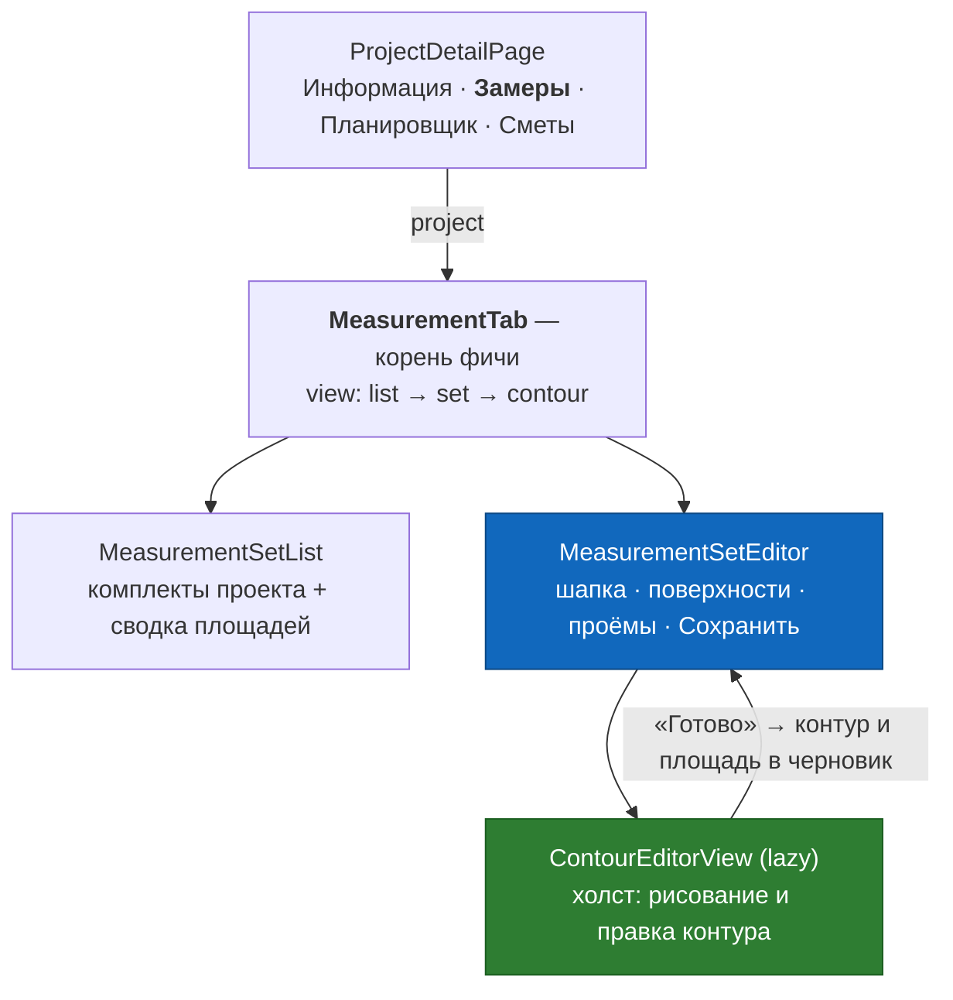
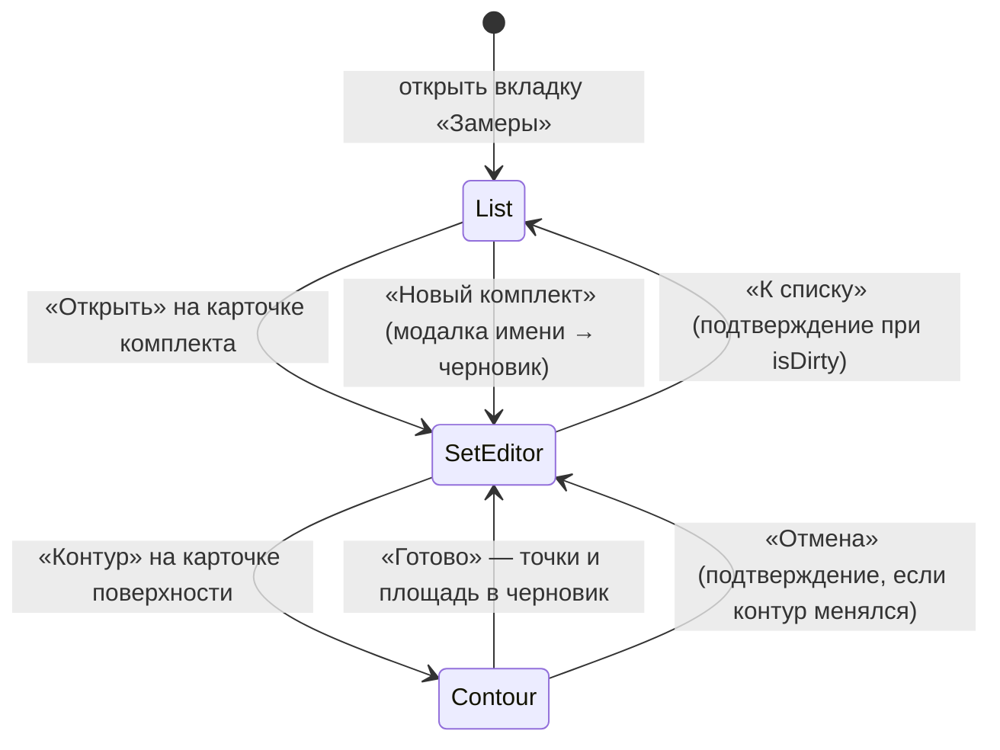
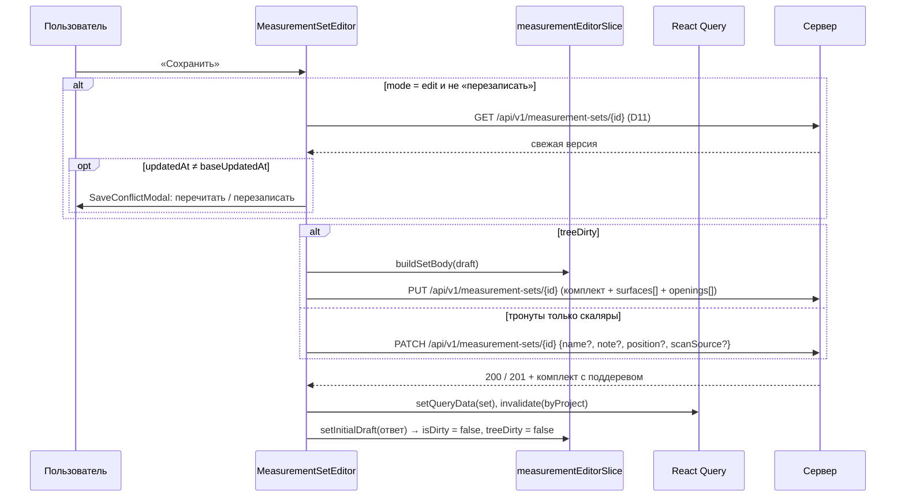

# DESIGN — Замер на вебе (measurement)

**Дата:** 13 августа 2026
**Область:** `web/` — React-клиент фичи «замер»: комплекты замеров, поверхности, проёмы и
полигон-редактор контура (первая стадия образца, **без симуляции укладки материала**)
**Вход:** [`RESEARCH_MEASUREMENT.md`](./RESEARCH_MEASUREMENT.md) (карта кода, контракт,
находки F-1…F-14, риски R-1…R-6)
**Образец UX:** `/Users/alex/Desktop/apps/fuenex/home_build_client` — первая стадия симулятора
(`RoomEditorStage.tsx`, `canvas/*`, `roomEditor/roomSlice.ts`, `geometry/*`) и экраны комнаты
(`components/rooms/*`)
**Образец структуры:** [`../estimate/DESIGN_ESTIMATE.md`](../estimate/DESIGN_ESTIMATE.md)
**Бекенд:** готов, менять не требуется
**Отменяет:** `DESIGN_MEASUREMENT.md` сервера, §10 вопрос 1 («ручной ввод замера с веба — не в
v1») — по заданию пользователя 13 августа 2026. Ни одной серверной правки отмена не требует (§17)

---

## 0. Ключевые решения (TL;DR)

| № | Решение | Почему |
|---|---|---|
| **D1** | Вкладка «Замеры» рендерит `<MeasurementTab project={project} />` вместо `ComingSoonTab` — **единственная правка в `ProjectDetailPage.tsx`** | так же встроилась смета (`DESIGN_ESTIMATE §1`); вкладка уже стоит в `TABS` |
| **D2** | Внутри вкладки — **три view: `list` → `set` → `contour`**, без под-вкладок | у замера нет владельческих справочников (каталога и шаблонов), под-вкладкам нечего показывать |
| **D3** | Черновик — RTK-слайс `measurementEditorSlice`: **один комплект целиком** (поверхности + проёмы + контуры) | `PUT` пишет комплект с поддеревом одной транзакцией (F-1) — единица правки на клиенте обязана совпадать с единицей записи |
| **D4** | **Единственный путь записи — `PUT /measurement-sets/{id}`** с полным поддеревом. `PATCH` комплекта — только для скаляров, когда поддерево не тронуто. Поштучные `PUT /surfaces/{id}` и `/openings/{id}` в v1 **не используются вовсе** | две ручки записи с **разной зоной поражения при чистке детей** (F-8) — гарантированный источник потерянных проёмов. Цена названа в §6.5 |
| **D5** | Числовые поля — **строковый буфер + коммит по `onBlur`**, откат на прежнее значение при мусоре | тот же приём, что в `EstimateItemsTable` |
| **D6** | Поверхности и проёмы — **`<table>` на `d-lg-table` + карточки на `d-lg-none`** | `CONVENTIONS.md` mobile-first; приём из сметы |
| **D7** | **Схема контура v1** — `{schemaVersion, units:"m", vertices[], edges[]}`, и этот документ **и есть договор клиентов между собой** | сервер контур не разбирает (RESEARCH §3.1); второго клиента, который пишет замер в SNG, сегодня нет (RESEARCH §6.3) |
| **D8** | **Внутри редактора — сантиметры, на проводе — метры.** Конвертация живёт ровно в одном файле `contourCodec.ts` | решение пользователя 13.08.2026; см. цену в §7.3 |
| **D9** | При наличии контура `areaM2` — **производная величина**, поле только читается; без контура — ввод руками | два источника истины для одной площади расходятся молча (F-3 + F-13) |
| **D10** | Рядом с валовой площадью **всегда** показывается чистая, обе подписаны словами | `areaM2` валовая по решению сервера (F-3); неподписанные площади путают ровно один раз |
| **D11** | Перед `PUT` — контрольный `GET`, при расхождении `updatedAt` — модалка «перечитать / перезаписать» | `If-Match` на сервере нет; дословно guard сметы (`DESIGN_ESTIMATE §11.3`), включая честную цену |
| **D12** | `type` поверхности — **`<input list>`: список констант + свободный ввод**; регистр не нормализуется никогда | решение 6 сервера (F-4): «массив констант плюс пользовательские значения» |
| **D13** | Новый комплект веба — `scanSource: "MANUAL"`; **чужой `scanSource` при правке не переписывается** | происхождение комплекта не меняется от правки вершины; пометка правки живёт на ребре (D14) |
| **D14** | Правка вершины помечает **два смежных ребра** `source:"manual"`; остальные рёбра сохраняют чужую пометку | `DESIGN_MEASUREMENT §3.1`: происхождение каждого ребра ведёт клиент |
| **D15** | Самопересечение при коммите вершины — **правка отклоняется** с сообщением, точка возвращается | образец (`RoomEditorStage.tsx:616`); полигон с восьмёркой ломает площадь молча |
| **D16** | Снап к сетке — **на коммите жеста**, не на каждом кадре; шаг сетки переключается (5/10/25/50 см), сетка сама выбирает шаг отрисовки по зуму (LOD) | образец, `GridLayer.tsx:38` |
| **D17** | Жесты — **только `pointer*`-события**, `draggable={false}` у Stage всегда, pan/зум/выбор вершины ведутся вручную | L-1…L-6 RESEARCH §7.3: перенос приёмов **вместе с комментариями** |
| **D18** | Редактор контура — **`React.lazy`-чанк**; `konva`/`react-konva` не попадают в основной бандл | R-1: первые зависимости проекта сверх Bootstrap |
| **D19** | Проёмы — **таблица под холстом**, на холсте не рисуются | у проёма нет геометрии в схеме (F-14); «поставить дверь на стену» потребовало бы поля, которого нет |
| **D20** | **Прямоугольник по двум числам** — быстрый способ задать контур (ширина × высота) | забор, фасад, стена по рулетке: рисовать четыре угла мышью — работа ради работы |
| **D21** | Мост в смету — **кнопка «скопировать площадь»** в буфер обмена, и ничего больше | связи в схеме нет по решению (`ADR-009` решение 2); прецедент — `DESIGN_ESTIMATE §3` |
| **D22** | Файлы: логика в `src/features/measurement/`, компоненты в `src/components/measurement/`, модалки в `src/components/modals/` | `CONVENTIONS.md`, как у сметы |
| **D23** | Фича **не делает**: симуляции укладки, загрузки USDZ/mesh, 3D, импорта планов, агрегатов в списке проектов | §17 |

---

## 1. Точка входа

```
web/src/features/projects/pages/ProjectDetailPage.tsx:147-149

- {activeTab === "measurement" && (
-   <ComingSoonTab text="Раздел «Замеры» появится вместе с фичей замера — сейчас она в проектировании." />
- )}
+ {activeTab === "measurement" && <MeasurementTab project={project} />}
```

`project` уже в области видимости. Маршруты (`App.tsx`) и `Navbar` не трогаются.



---

## 2. Что берём из образца и что осознанно меняем

| Аспект | Образец (`home_build_client`) | Замер (здесь) | Причина расхождения |
|---|---|---|---|
| Холст | `react-konva` | **`react-konva`** | решение пользователя; перенос почти дословный |
| UI-кит | MUI + Bootstrap вперемешку | **только ванильный Bootstrap** | `CONVENTIONS.md` |
| Тексты | `react-i18next` | русские строки в коде | i18n в SNG-вебе нет |
| Единицы состояния | см | **см** (метры на проводе) | решение пользователя, §7.3 |
| Иерархия | Room → Surface → Zone + Opening | **MeasurementSet → Surface → Opening** | зон в схеме SNG нет; площадь из контура |
| Геометрия поверхности | отдельный ресурс `PUT /surfaces/{id}/geometry` | **поле `contour` внутри поверхности** | `DESIGN_MEASUREMENT §3.2`: ревизий геометрии нет, отдельная таблица не нужна |
| Площадь | считает сервер (Java, JTS) | **считает клиент** (шнуровка) | `ADR-001 §6`: сервер не считает никогда (F-10) |
| Запись | 23 запроса на применение скана | **один `PUT`, одна транзакция** | `DESIGN_MEASUREMENT §5` — измерение, а не вкус |
| Сохранение | автосейв конфигурации + «Speichern» | **одна явная кнопка на комплекте** | `PUT` — полная замена поддерева (F-1): автосейв здесь генератор потерь |
| Шаги | wizard из двух стадий | **нет wizard**, редактор контура — экран поверхности | вторая стадия вне области |
| Тип поверхности | `enum SurfaceType {FLOOR,WALL,CEILING}` | **свободная строка + список констант** | решение 6 сервера (F-4) |
| Проёмы | ширина/высота/глубина/откосы/подоконник | **ширина/высота/`deduct`/порядок** | параметры раскладки не переносятся (решение 4 сервера) |
| Диагностика жеста | кнопка 🐞 + лог на экране | нет | инструмент отладки конкретного бага |

**Переносится почти дословно:** `SimStage` (zoom/pan/pinch/`fitToBBox`), `GridLayer` (LOD),
`SimCornerHandle`, `SimDimensionLabel`, `SimAngleLabel`, весь pointer-пайплайн
`RoomEditorStage` (L-1…L-6), `polygonArea.ts`, `isSelfIntersecting.ts`, `computeAngle.ts`,
защита от вершины-дубля в редьюсере.

---

## 3. Навигация внутри вкладки



Состояние — в `MeasurementTab`: `view: "list" | "set" | "contour"`,
`selectedSetId: string | null`, `contourSurfaceId: string | null`.

**Уход из `set` при `isDirty` требует подтверждения** — черновик комплекта живёт только в памяти.
**Редактор контура ничего не сохраняет на сервер сам**: «Готово» кладёт результат в черновик
комплекта, запись — кнопкой «Сохранить» уровнем выше (D4). Это прямое следствие того, что контур
и площадь поверхности пишутся тем же `PUT`, что и всё остальное.

---

## 4. Карта компонентов и файлов

```
src/features/measurement/                    ← логика фичи
├── measurement.api.ts        # apiFetch: getTree, getSet, putSet, patchSet, removeSet
├── measurement.hooks.ts      # useQuery/useMutation, ключи кэша, инвалидация
├── measurementEditorSlice.ts # черновик комплекта + состояние редактора контура (§5)
├── measurementEditorSlice.test.ts
├── types.ts                  # wire-типы + MEASUREMENT_LIMITS (RESEARCH §4, §5)
├── constants.ts              # SURFACE_TYPES, SCAN_SOURCE_LABELS, OPENING_KIND_LABELS,
│                             # GRID_STEPS_CM, DEFAULT_GRID_STEP_CM, SCALE_PX_PER_CM
├── contour/
│   ├── contourSchema.ts      # типы схемы v1 (§7.1)
│   ├── contourCodec.ts       # parseContour (терпимый guard, → см) / buildContour (→ м)
│   └── contourCodec.test.ts  # ЕДИНСТВЕННОЕ место конвертации единиц (D8)
├── geometry/
│   ├── polygonArea.ts        # shoelace, периметр, длина отрезка   ← образец
│   ├── isSelfIntersecting.ts # CCW + коллинеарные наложения        ← образец
│   ├── computeAngle.ts       # угол при вершине                     ← образец
│   ├── snapToGrid.ts         # снап точки к шагу сетки
│   ├── rectangleContour.ts   # D20: прямоугольник по ширине/высоте
│   └── *.test.ts
└── utils/
    ├── buildSetBody.ts       # черновик → тело PUT (position = индекс, ключи всегда, §6.4)
    ├── buildSetBody.test.ts
    ├── areas.ts              # openingsArea, netArea, сводка комплекта по type
    └── areas.test.ts

src/components/measurement/                  ← .tsx фичи
├── MeasurementTab.tsx        # корень: view-навигация
├── MeasurementSetList.tsx    # список комплектов проекта, порядок, удаление
├── MeasurementSetEditor.tsx  # шапка комплекта, поверхности, «Сохранить»
├── SurfaceList.tsx           # таблица (lg+) / карточки (<lg)
├── SurfaceRow.tsx            # строка/карточка: тип, имя, площади, проёмы, «Контур»
├── OpeningsTable.tsx         # проёмы поверхности
├── AreaSummary.tsx           # сводка площадей комплекта по типам поверхностей
└── contour/                  # ← весь Konva живёт ТОЛЬКО здесь (D18)
    ├── ContourEditorView.tsx # экран: холст + тулбар + статус-строка + панель вершины
    ├── ContourStage.tsx      # Stage: zoom колесом, pinch, fitToBBox, экран→см  ← SimStage
    ├── ContourGridLayer.tsx  # сетка с LOD                                       ← GridLayer
    ├── VertexHandle.tsx      # хендл вершины                                     ← SimCornerHandle
    ├── DimensionLabel.tsx    # подпись длины стороны                             ← SimDimensionLabel
    ├── AngleLabel.tsx        # дуга и подпись угла                               ← SimAngleLabel
    └── ContourToolbar.tsx    # режим, шаг сетки, Fit, «Замкнуть», «Готово»

src/components/modals/                       ← модалки (CONVENTIONS.md)
├── MeasurementSetFormModal.tsx   # создание и переименование комплекта
├── SurfaceFormModal.tsx          # тип, имя, высота, площадь вручную
├── OpeningFormModal.tsx          # вид, ширина, высота, «вычитать из площади»
├── RectangleContourModal.tsx     # D20: контур по двум числам
└── DeleteMeasurementSetModal.tsx # подтверждение удаления комплекта
```

**Трогаем существующее — три файла и ни одним больше:**

1. `ProjectDetailPage.tsx` — §1;
2. `src/app/store.ts` — регистрация слайса в `combineSlices`;
3. `src/components/modals/SaveConflictModal.tsx` — **обобщение пропсов**: сейчас он принимает
   `estimate: Estimate` (`:7`), а нужен `{title, updatedAt, onRead, onOverwrite, onClose}`.
   Правка — три строки в модалке и одна на месте вызова в `EstimateEditorView`. Второй экземпляр
   той же модалки под другим типом — худший из двух вариантов.

Плюс `package.json`: `konva`, `react-konva`.

---

## 5. Состояние редактора (`measurementEditorSlice`)

### 5.1 Форма

```ts
type MeasurementEditorState = {
  draft: SetDraft | null
  baseUpdatedAt: string | null   // updatedAt серверной версии — для D11
  isDirty: boolean               // что-угодно тронуто → кнопка «Сохранить» активна
  treeDirty: boolean             // тронуто поддерево → PUT; иначе PATCH скаляров (§6.3)
  contour: ContourEditorState | null   // открытый редактор контура одной поверхности
}

type SetDraft = {
  id: string                     // UUIDv7, чеканится при создании до первого PUT
  projectId: string
  name: string
  note: string
  position: number               // приходит с сервера, редактором не пересчитывается (§8.2)
  scanSource: ScanSource         // «MANUAL» у своих, чужой не переписываем (D13)
  surfaces: SurfaceDraft[]       // порядок массива И ЕСТЬ position
}

type SurfaceDraft = {
  id: string
  type: string                   // свободная строка (D12)
  name: string
  contourCm: ContourDraft | null // null = «контур не снят» (F-5); ВНУТРИ — сантиметры (D8)
  heightM: number | null
  areaM2: number                 // ВАЛОВАЯ; производная при наличии контура (D9)
  openings: OpeningDraft[]       // порядок массива И ЕСТЬ position
}

type ContourDraft = {
  points: PointCm[]              // { x, y } в сантиметрах
  edgeSources: EdgeSource[]      // параллельный массив длиной points.length (D14)
  schemaVersion: number          // версия схемы, с которой контур прочитан (§7.4)
}

type OpeningDraft = {
  id: string
  kind: "DOOR" | "WINDOW" | "OPENING"
  widthM: number
  heightM: number
  deduct: boolean
}

type ContourEditorState = {
  surfaceId: string
  mode: "draw" | "edit"
  points: PointCm[]              // рабочая копия, коммитится в draft по «Готово»
  edgeSources: EdgeSource[]
  gridStepCm: number             // 5 | 10 | 25 | 50, по умолчанию 10
  selectedVertex: number | null
  error: string | null           // «самопересечение» и подобное
  isDirty: boolean
}
```

### 5.2 Три решения о форме состояния

**Единица черновика — комплект, а не поверхность (D3).** `PUT` пишет комплект целиком одной
транзакцией; если бы черновиком была поверхность, при сохранении пришлось бы собирать тело из
кэша React Query и черновика одновременно — то есть держать в голове, какая часть дерева свежая.
Комплект из скана — 6–12 поверхностей, это десятки килобайт: держать его в памяти целиком дёшево.

**Редактор контура работает на копии, а не прямо в черновике.** Причина не в
производительности (драг и так идёт в локальном стейте компонента, §9.4), а в «Отмене»: чтобы
вернуть контур как был, нужен снимок, и рабочая копия — это он и есть. Коммит по «Готово»
записывает в поверхность сразу `contourCm`, `areaM2` и поднимает `treeDirty`.

**`position` не хранится ни у поверхности, ни у проёма** — его роль играет индекс массива, а в
тело `PUT` он попадает при сборке (`buildSetBody`). У самого комплекта `position` хранится:
порядок комплектов правится в списке (§8.2), а не в редакторе.

### 5.3 Actions и selectors

```
Комплект:  setInitialDraft(set) · startNewDraft({projectId, name}) · updateSetScalar({field,value})
           regenerateDraftId() · resetEditor()
Поверхности: addSurface(SurfaceDraft) · updateSurface({id, patch}) · removeSurface(id)
             moveSurface({from, to})
Проёмы:      addOpening({surfaceId, opening}) · updateOpening({surfaceId, id, patch})
             removeOpening({surfaceId, id}) · moveOpening({surfaceId, from, to})
Контур:      openContourEditor(surfaceId) · closeContourEditor()
             setContourMode(mode) · addPoint(PointCm) · movePoint({index, point})
             removePoint(index) · selectVertex(index|null) · setGridStep(cm)
             setContourError(msg|null) · replaceContour({points, edgeSources})  // D20
             commitContour()   // копия → поверхность: contourCm + areaM2 + treeDirty
```

Selectors: `selectDraft` · `selectIsDirty` · `selectTreeDirty` · `selectBaseUpdatedAt` ·
`selectContourEditor` · `selectSurfaceAreas(surfaceId)` (мемоизированный, §8.1) ·
`selectSetSummary` (сводка по типам, §8.3).

**Защита от вершины-дубля живёт в редьюсере `addPoint`** — переносится из образца
(`roomSlice.ts:26-45`) вместе с объяснением: один тап на тач-устройстве может дойти дважды, а
совпадающая вершина делает контур вырожденным и ломает проверку самопересечения (L-3).

---

## 6. Чтение и сохранение

### 6.1 Ключи кэша

| Ключ | Что | Инвалидация |
|---|---|---|
| `["measurement", "byProject", projectId]` | всё дерево замера проекта (`GET /projects/{id}/measurement`) | после `PUT`, `PATCH`, `DELETE` любого комплекта |
| `["measurement", "set", id]` | один комплект с поддеревом | `setQueryData` ответом `PUT`/`PATCH`; `removeQueries` после `DELETE` |

Отдельного запроса «список комплектов» на сервере нет — дерево приходит целиком, и это
удобно: список, сводка площадей и открытие комплекта обслуживаются одним кэшем.
Контрольный `GET` перед записью (D11) идёт **мимо кэша**, прямым вызовом `measurementApi.getSet`.

### 6.2 Поток сохранения



### 6.3 Развилка `PUT` / `PATCH`

`treeDirty` поднимается **любым** касанием поверхностей, проёмов или контура; `isDirty` — вообще
любым изменением. Переименование комплекта или правка заметки без единого касания поддерева
уходит `PATCH`-ем — он дешевле и, главное, **не трогает детей вовсе** (`ADR-012`, находка 3).
Флаг ведётся отдельно ровно ради этой развилки, как `itemsDirty` у сметы.

### 6.4 Тело `PUT` (`buildSetBody`)

```ts
export const buildSetBody = (d: SetDraft): MeasurementSetInput => ({
  projectId: d.projectId,
  name: d.name,
  note: d.note,
  position: d.position,
  scanSource: d.scanSource,
  surfaces: d.surfaces.map((s, position) => ({
    id: s.id,
    type: s.type,
    name: s.name,
    position,
    contour: s.contourCm ? buildContour(s.contourCm) : null,   // см → м, §7
    heightM: s.heightM,
    areaM2: s.areaM2,
    openings: s.openings.map((o, p) => ({ ...o, position: p })),
  })),
})
```

> ⚠️ Ключи `surfaces` и `openings` присутствуют **всегда**, даже пустыми массивами. Отсутствующий
> ключ и пустой массив означают на сервере одно и то же — **удалить всех детей** (F-1). Ветки
> «если пусто — не слать ключ» не должно существовать ни при каких обстоятельствах; тест
> `buildSetBody.test.ts` фиксирует это первым случаем.

Пустой контур не отправляется никогда: `points.length < 3` → `contour: null` (F-5).

### 6.5 Цена решения «пишем только комплектом» (D4)

Правка одного проёма отправляет весь комплект. Оценка объёма: 12 поверхностей × (контур 4–12
вершин ≈ 0.5 КБ + метаданные) ≈ **10–20 КБ** — при лимите тела в 1 МБ и лимите контура в 32 КБ.
Патологический случай (12 поверхностей по 480 вершин) даёт ≈ 380 КБ и всё ещё проходит.

Что мы за это получаем: **один путь записи, одна транзакция, никакой возможности перепутать
зону чистки детей** (F-8: комплектный `PUT` чистит проёмы по всему комплекту, поверхностный —
только своей поверхности; в Java-предке аналогичная ошибка оставляла проёмы, привязанные к
мёртвой поверхности, и жила бы до первого `/sync`).

**Триггер пересмотра:** появление комплекта, который реально не влезает в один запрос, или
жалоба на скорость сохранения. Тогда поштучный `PUT /surfaces/{id}` включается ровно для
редактора контура — и вместе с ним придётся написать тест «поверхностный `PUT` не трогает проёмы
соседей» (`ADR-012` его на сервере уже имеет: `TestSurfaces_Put_DoesNotTouchSiblingOpenings`).

---

## 7. Контур: схема v1 — договор клиентов между собой

Сервер контур не разбирает и не проверяет (кроме размера ≤ 32 КБ и синтаксиса JSON). Значит его
форму задают клиенты, и **этот раздел — договор**. Второго клиента, пишущего замер в SNG,
сегодня нет (RESEARCH §6.3), поэтому договор пишется здесь и сейчас, до первых данных — ровно
как советует `DESIGN_MEASUREMENT §10`, вопрос 6.

### 7.1 Форма на проводе

```jsonc
{
  "schemaVersion": 1,
  "units": "m",                        // на проводе ВСЕГДА метры (DESIGN_MEASUREMENT §3.6)
  "vertices": [                        // ≥3, порядок обхода — как нарисовано, полигон замкнут неявно
    { "x": 0,     "y": 0 },
    { "x": 4.2,   "y": 0 },
    { "x": 4.2,   "y": 3.1 },
    { "x": 0,     "y": 3.1 }
  ],
  "edges": [                           // ребро i соединяет vertices[i] → vertices[(i+1) % n]
    { "index": 0, "lengthM": 4.2, "source": "manual" },
    { "index": 1, "lengthM": 3.1, "source": "manual" },
    { "index": 2, "lengthM": 4.2, "source": "manual" },
    { "index": 3, "lengthM": 3.1, "source": "manual" }
  ]
}
```

`source ∈ { "manual" | "lidar" | "ar_ruler" | "laser" }` — происхождение **этой стороны**.
Механизм взят из немецкой платформы и прямо предусмотрен `DESIGN_MEASUREMENT §3.1`: «пометка
происхождения каждого ребра живёт внутри контура, где её кладёт и читает клиент».

**Чего в схеме нет и почему:**

| Поле | Почему нет |
|---|---|
| `deviceId`, `measuredAt` (есть у образца) | у веба нет ни того, ни другого; писать `null` в каждое ребро — 30 байт мусора на сторону. Читатель их игнорирует, если придут |
| замыкающая вершина (дубль первой) | полигон замкнут по построению; дубль ломает шнуровку и подсчёт сторон |
| `areaM2` внутри контура | площадь живёт в своей колонке; две копии разойдутся |
| единицы на уровне вершины | одни единицы на весь контур |

### 7.2 Что означает `lengthM`, если он выводится из вершин

Избыточное поле — сознательно. Для веба `lengthM` всегда равен расстоянию между вершинами, и
считать его лишний раз незачем. Для AR-линейки (будущий iOS) **измеренная** длина и вычисленная
могут разойтись, и тогда `lengthM` — то, что реально показал прибор. Правило чтения одно:
**геометрия — это `vertices`; `edges[].lengthM` справочный** и на площадь не влияет.

### 7.3 Единицы: метры на проводе, сантиметры внутри (D8)

Решение пользователя. Конвертация живёт **в одном файле** — `contourCodec.ts`:

```ts
export const parseContour = (raw: unknown): ContourDraft | null   // → сантиметры, терпимо (§7.4)
export const buildContour = (c: ContourDraft): ContourWireV1      // → метры, строго
```

**Честная цена:** появляется место, где ошибка на два порядка возможна в принципе; у варианта
«метры насквозь» его бы не было. Что это компенсирует: снап к сетке, допуски и все константы
редактора (шаг 10 см, допуск захвата, порог pan) переносятся из образца числами, а не
пересчитываются — а именно эти числа выстраданы на живом устройстве (L-1…L-6).

**Правила, которые делают цену управляемой:**

- ни одна другая функция фичи не умножает и не делит на 100 — грепом `/100|\*\s*100/` по
  `src/features/measurement/` должен находиться только `contourCodec.ts`;
- имена переменных несут единицу: `pointsCm`, `areaM2`, `widthM`, `gridStepCm` — как в образце;
- тест кодека — round-trip: `parse(build(x)) === x` на десяти контурах, включая невыпуклый.

### 7.4 Читатель обязан быть терпимым

`contour` приходит как `unknown` — сервер его не смотрел. Поэтому `parseContour` — guard, а не
приведение типа:

| Вход | Поведение |
|---|---|
| `null` | `null` — «контур не снят» (F-5) |
| не объект / нет `vertices` / вершин < 3 | `null` + `console.warn`; поверхность показывается как «контур не снят» |
| `units: "cm"` | принимается, координаты как есть (внутри у нас сантиметры) |
| `units` отсутствует | считается `"m"` — так пишет схема v1 |
| нет `edges` или длина не совпала с числом вершин | восстанавливается: `lengthM` из вершин, `source: "manual"` |
| `lengthCm` вместо `lengthM` | принимается (формат образца) |
| незнакомый `schemaVersion` > 1 | контур **читается** по правилам v1 и **показывается**, но редактор предупреждает: «контур снят более новой версией приложения; правка перезапишет его в формате v1» |
| незнакомые поля | игнорируются; **при перезаписи теряются** — цена названа в §16, вопрос 3 |
| `NaN`/`Infinity` в координатах | контур целиком считается нечитаемым → `null` |

**Падать нельзя ни при каких данных.** Битый контур не должен уносить весь экран замера: у
проекта может быть десять комплектов, и девять из них в порядке.

### 7.5 Происхождение рёбер при правке (D14)

```
перенос вершины i        → рёбра (i−1) и i         → source = "manual"
добавление вершины       → новые рёбра             → source = "manual", остальные сохраняются
удаление вершины i       → объединённое ребро      → source = "manual"
«прямоугольник» (D20)    → все рёбра               → source = "manual"
масштаб/pan/zoom, выбор  → ничего не меняют
```

`scanSource` комплекта при этом **не трогается** (D13): комплект, снятый LiDAR-ом и поправленный
на вебе, остаётся `LIDAR` — а какие именно стороны трогали руками, видно по рёбрам. Ровно это
разделение и заложено в проектировании сервера.

---

## 8. Геометрия и площади

### 8.1 Валовая площадь — шнуровка, и это эталон (F-10)

```ts
// geometry/polygonArea.ts — перенос образца, единственная реализация в проекте
export function polygonArea(points: PointCm[]): number    // см², формула Гаусса, |Σ| / 2
export function polygonPerimeter(points: PointCm[]): number
export function segmentLength(a: PointCm, b: PointCm): number

// utils/areas.ts
export const grossAreaM2 = (points: PointCm[]): number =>
  round2(polygonArea(points) / 10_000)      // см² → м²
```

Округление — **до двух знаков, один раз, на границе см²→м²**. Причина: `areaM2` уходит на сервер
как есть и там же показывается пользователю; хранить 12.443999999999999 и показывать 12.44 значит
завести два числа вместо одного.

**Почему это эталон.** Сервер площадь не считает никогда, значит при появлении iOS-клиента SNG у
одного контура будет два вычислителя (F-10). Митигация — фикстуры: `geometry/__fixtures__/
polygon_area.json` (квадрат, невыпуклый, «Г»-образный, с точностью до сантиметра, 480-вершинный
круг) и тест поверх них. Тот же файл получает iOS, когда его начнут писать.

### 8.2 Чистая площадь считает клиент (D10)

```ts
export const openingsDeductedM2 = (openings: OpeningDraft[]): number =>
  round2(openings.reduce((s, o) => s + (o.deduct ? o.widthM * o.heightM : 0), 0))

export const netAreaM2 = (gross: number, deducted: number): number =>
  Math.max(0, round2(gross - deducted))
```

Ноль снизу — не косметика: три двери на маленькой перегородке дают отрицательную площадь, и
показывать её нельзя. Отдельно показывается предупреждение «проёмы больше поверхности» — это
почти всегда опечатка в размерах.

На экране рядом всегда две подписанные величины:

```
Площадь (валовая)   12.44 м²
Проёмы (вычет)      −1.85 м²
Чистая площадь      10.59 м²
```

Валовая площадь — то, что лежит на сервере в `areaM2`; чистая нигде не хранится и считается
каждый раз. Так решено на сервере (F-3), и клиент обязан этому соответствовать, а не «улучшать».

### 8.3 Сводка комплекта — по `type`, и это единственное, для чего он нужен клиенту

`AreaSummary` группирует поверхности по `type` **как по строке, без нормализации регистра**
(F-4) и показывает: сумму валовых, сумму чистых, число поверхностей. Порядок групп — известные
константы в порядке `SURFACE_TYPES`, затем пользовательские по алфавиту.

Это и есть то, ради чего `type` остался в схеме (решение 3 сервера): «площадь пола отдельно от
площади стен при переносе в смету».

### 8.4 Самопересечение (D15)

`isSelfIntersecting` — перенос образца; вызывается **на коммите переноса вершины в edit-режиме**.
Самопересечение → правка отклоняется, точка возвращается на место, в статус-строке
«Стороны пересекаются — контур так не замкнуть».

В draw-режиме проверка **не** выполняется — контур ещё строится, и промежуточная восьмёрка
нормальна. Так же поступает образец, и по той же причине (`RoomEditorStage.tsx:598-601`).

### 8.5 Длины, углы и что с ними можно делать в v1

Показываем: длину каждой стороны (подпись у середины), угол при выделенной вершине (дуга +
градусы), периметр в статус-строке. **Правку контура вводом чисел** (`rescaleByLengths.ts` из
образца) в v1 не делаем: у образца эта функция написана, но ни одним экраном не вызывается —
переносить неиспользуемый код незачем. Взамен для прямых форм есть D20.

---

## 9. Полигон-редактор (первая стадия)

### 9.1 Экран

```
┌─────────────────────────────────────────────────────────────┐
│ ← К комплекту   Стена 1 · Кухня        [✎ Рисовать][✋ Правка]│  ContourToolbar
│                                        [сетка 10 см ▾][⤢][✓]│
├─────────────────────────────────────────────────────────────┤
│                                                             │
│                    ХОЛСТ (Konva Stage)                      │  ContourStage
│              сетка · контур · вершины · подписи             │  + ContourGridLayer
│                                                             │  + VertexHandle ×n
│                                                             │  + DimensionLabel ×n
│                                                             │  + AngleLabel
├─────────────────────────────────────────────────────────────┤
│ 4 вершины · периметр 14.6 м · площадь 12.44 м²   [Готово]   │  статус-строка
└─────────────────────────────────────────────────────────────┘
```

Высота холста — `min(70vh, доступная)`, ширина — контейнер; размер снимается `ResizeObserver`-ом
(образец: реагирует на flex-reflow, а не только на `window.resize`).

### 9.2 Жесты — таблица истины

| Жест | draw | edit |
|---|---|---|
| тап по пустому полю | **добавить вершину** (снап к сетке) | снять выделение |
| тап по вершине | если это первая и вершин ≥ 3 — **замкнуть контур** (→ edit) | выделить / снять выделение |
| драг вершины | перенести | перенести + проверка самопересечения (D15) |
| драг по пустому полю | pan | pan |
| колесо / pinch | zoom к точке курсора | zoom |
| двойной тап | — | — (сознательно: на тач двойной тап ненадёжен) |
| «⤢ Fit» | вписать контур в экран | то же; плюс **автоматически при первом входе в edit** |

Порог «тап или pan» — 4 px в экранных пикселях; **до превышения порога позиция Stage не
трогается вовсе**, иначе микро-дрожание навсегда сдвигает камеру (L-5).

### 9.3 Что переносится из образца дословно

| Приём | Откуда | Зачем (короткая версия L-1…L-6) |
|---|---|---|
| ручной поиск ближайшей вершины с допуском 32 экранных px | `RoomEditorStage.tsx:44,60` | hit-test Konva отдаёт не ту вершину, когда две рядом |
| подписка **только** на `pointerdown/move/up/cancel` + `preventDefault()` | `:379,395` | один тап приходит тремя семействами событий и стартует жест дважды |
| защита «жест уже идёт» (`if (dragAnchor \|\| panAnchor) return`) | `:387` | то же, на уровне анкера |
| дельта драга в экранных px ÷ масштаб **на момент захвата** | `:255-272,459` | зум/pan посреди жеста делает координаты мусором |
| `draggable={false}` всегда + ручной pan | `:666` | Konva крадёт старт жеста на `mousedown` раньше нашего обработчика |
| отбрасывание вершины-дубля в редьюсере | `roomSlice.ts:26-45` | двойной `addPoint` от одного тапа → вырожденный контур |
| bbox сетки = viewport ∪ bbox контура + запас | `:118-151` | иначе сетка обрывается на экране |
| шаг сетки по зуму (LOD), крупная линия каждый метр | `GridLayer.tsx:25-43` | на отдалении сетка 10 см — каша |
| `fitToBBox` + авто-fit при первом входе в edit | `SimStage.tsx:125`, `RoomEditorStage.tsx:171-180` | комната 30×30 м, нарисованная издалека, не видна целиком |
| pinch нативным `touchmove` с `{passive:false}` | `SimStage.tsx:188-256` | Konva-пропы не доходят, когда Stage в своём drag-pipeline |
| коалесация трансформации через `requestAnimationFrame` | `:310-328` | `pointermove` приходит чаще, чем рисуются кадры |
| `touchAction: "none"` на контейнере Stage | `SimStage.tsx:285` | иначе страница скроллится под пальцем во время рисования |

**Комментарии переносятся вместе с кодом.** Каждый из этих приёмов выглядит как усложнение и
будет «упрощён» первым же, кто их прочитает без объяснения, — а воспроизводятся баги только на
планшете (R-2).

### 9.4 Производительность

Драг ведётся в **локальном стейте компонента** (`localPoints`), в Redux уходит один `movePoint`
на `pointerup` — как в образце. Redux во время жеста не трогается вовсе; сетка перерисовывается
не чаще кадра.

### 9.5 Быстрый ввод: прямоугольник (D20)

Модалка `RectangleContourModal`: ширина и высота в метрах → контур из четырёх вершин,
`source: "manual"`, площадь считается той же шнуровкой (не умножением!) — чтобы у площади в
системе был **один** вычислитель. Кнопка доступна и когда контура нет, и когда есть (тогда
заменяет с подтверждением).

Это основной путь для забора, фасада, тротуара и стены «по рулетке» — то есть для всего, ради
чего `Room` стал `MeasurementSet`.

---

## 10. Экраны

### 10.1 Список комплектов (`MeasurementSetList`)

Карточка комплекта: имя, бейдж `scanSource`, число поверхностей, **валовая и чистая площадь
суммарно**, заметка (одна строка, `text-truncate`), кнопки «Открыть», «↑/↓», «🗑».
Порядок — по `position`; перестановка — стрелки, каждая шлёт `PATCH {position}` соседям
(две ручки, атомарности здесь не требуется: разъехавшийся порядок исправляется следующей
стрелкой).

Пустое состояние: иконка, текст «В проекте пока нет замеров», кнопка «Создать комплект».
Наверху — сводка по проекту (сумма площадей по типам, §8.3), она же ответ на вопрос «зачем
открывать проект».

### 10.2 Карточка комплекта (`MeasurementSetEditor`)

Шапка (`card`, `row g-3`): `name` (`maxLength=128`), `note` (`textarea`, 512), `scanSource`
(`select`, у своих комплектов по умолчанию `MANUAL`). Коммит по `onBlur`.

Далее — список поверхностей (`SurfaceList`), у каждой:

| Колонка (lg+) | Содержимое |
|---|---|
| № / ↑↓ | порядок стрелками |
| Тип | `<input list="surface-types">` — константы + свой ввод (D12) |
| Название | `input`, 128 |
| Высота | `input`, м, пусто = «не задана» |
| Площадь | **валовая**; при наличии контура — только чтение с иконкой «из контура» |
| Чистая | производная (§8.2), справочная |
| Проёмы | `n` + раскрытие таблицы проёмов |
| Действия | «Контур», 🗑, «⧉ копировать площадь» (D21) |

На `<lg` — карточка на поверхность: тип и имя сверху, площади в две колонки, кнопки в подвале.

Внизу — панель действий: `Сохранить` (`disabled={!isDirty || isPending}`), бейдж «Не сохранено»,
`Добавить поверхность`, `К списку`. На узких экранах панель прилипает к низу
(`position-sticky bottom-0`) — как панель итогов у сметы.

### 10.3 Проёмы (`OpeningsTable`)

Строка: вид (`select`: Дверь / Окно / Проём), ширина (м), высота (м), площадь (производная,
`w × h`), чекбокс «Вычитать из площади», 🗑. Добавление — «+ Проём» с дефолтами двери
(0.9 × 2.05, `deduct: true`), чтобы типовой случай стоил один клик.

Геометрии у проёма нет (F-14) — ни на холсте, ни в форме этого не обещаем.

---

## 11. Ошибки и граничные случаи

### 11.1 Коды

| Ситуация | Что показываем |
|---|---|
| `400 VALIDATION_ERROR` | сообщение сервера + подсветка поля. **Это баг клиента**: всё, что проверяет сервер, проверено до отправки (§12) |
| `404` при `GET` дерева | «Проект не найден — возможно, удалён» + «К списку проектов» |
| `404` при `PUT` | комплект или проект удалены в другом окне: черновик **не теряем**, предлагаем «Сохранить как новый» (`regenerateDraftId`) |
| `413` | «Замер слишком большой — упростите контуры (меньше вершин) или разбейте комплект». Достижимо только патологией (§6.5) |
| `401` | обрабатывает `apiFetch`; при неудаче `ProtectedRoute` уводит на логин |
| сеть / `500` | «Не удалось сохранить. Черновик остался в редакторе» — `isDirty` не сбрасываем |

### 11.2 Пограничные состояния

| Случай | Поведение |
|---|---|
| у проекта нет замеров | empty-state с кнопкой «Создать комплект» |
| комплект без поверхностей | пустая таблица + «Добавить поверхность»; сохранять такой комплект **можно** (вырожденный комплект законен — решение 5 сервера) |
| поверхность без контура | площадь вводится руками; кнопка «Контур» открывает пустой редактор в draw-режиме |
| контур из 1–2 вершин при выходе из редактора | «Готово» заблокировано; «Отмена» возвращает прежний контур |
| контур нечитаем (§7.4) | поверхность как «контур не снят» + предупреждение в карточке, данные не трогаем, пока пользователь сам не перерисует |
| проёмы больше поверхности | чистая площадь 0 + предупреждение «проёмы больше поверхности» |
| 200 поверхностей / 50 проёмов | кнопки добавления гаснут, счётчик `n / 200` появляется от 150 |
| уход из редактора комплекта при `isDirty` | модалка «Черновик не сохранён» |
| закрытие браузера при `isDirty` | `beforeunload` — единственный нативный диалог |

### 11.3 Конкурентная правка — честная граница (D11)

Дословно как у сметы: контрольный `GET` перед `PUT`, сравнение `updatedAt` с `baseUpdatedAt`,
модалка «Перечитать / Перезаписать». Между `GET` и `PUT` остаётся окно в десятки миллисекунд.
Guard превращает «молча потерял замер» в «потерял, если попал в окно» — и это всё. Настоящее
решение — `If-Match` на сервере, и оно не в v1 (`DESIGN_PROJECT §8.4`).

Для замера цена выше, чем для сметы: `PUT` заменяет **три уровня**, и «перезаписать» здесь
означает в том числе удалить чужие поверхности. Формулировка в модалке это называет прямо.

---

## 12. Валидация на клиенте

```ts
export const MEASUREMENT_LIMITS = {
  setName: 128, setNote: 512, surfaceName: 128, surfaceType: 64,
  maxPosition: 9999,
  maxSurfacesPerSet: 200, maxOpeningsPerSurface: 50,
  maxContourBytes: 32 * 1024,
  maxAreaM2: 100_000, maxDimensionM: 100,
} as const
```

- длины — в рунах (`Array.from(s).length`), как у сметы;
- размер контура проверяется **в байтах готового JSON** перед отправкой:
  `new TextEncoder().encode(JSON.stringify(contour)).length ≤ 32768`;
- `NaN`/`Infinity` не могут попасть в состояние: числовые поля коммитятся через парсер, мусор
  откатывается (D5);
- `scanSource` и `kind` — `select`, произвольную строку ввести нельзя;
- `type` — **не валидируется ничем, кроме длины**. Ни регистр, ни алфавит, ни принадлежность
  списку: это прямое требование решения 6 сервера, и «улучшение» здесь ломает совместимость с
  будущим iOS;
- **кнопка «Сохранить» не блокируется валидацией** — только `!isDirty` и `isPending`. Запрет
  сохранения — верный способ заставить пользователя потерять работу.

---

## 13. Мобильный минимум и доступность

- Mobile-first: карточки по умолчанию, таблица — улучшение для `lg+`.
- Холст: `touch-action: none` на контейнере, высота ≤ 70vh, тулбар над холстом, статус-строка
  под ним — на 360 px всё это помещается без горизонтального скролла.
- Цели касания: хендл вершины — 32 px эффективного допуска (не визуального радиуса, L-1);
  кнопки — не меньше 32 × 32 px.
- Клавиатура: в редакторе контура — `Esc` снимает выделение вершины, `Delete` удаляет выделенную
  (при ≥ 4 вершинах). Полноценный ввод контура с клавиатуры **не заявляем** — вместо него
  доступен путь без холста вовсе: прямоугольник (D20) и ручной ввод площади (D9).
- Все поля с `<label>`, иконочные кнопки с `aria-label` и `title`.
- Ошибки контура — текстом в статус-строке, не только цветом.

---

## 14. Тесты (vitest + RTL)

| Файл | Что проверяет |
|---|---|
| `geometry/polygonArea.test.ts` | фикстуры §8.1: квадрат, невыпуклый, «Г», 480 вершин; порядок обхода не влияет на знак |
| `geometry/isSelfIntersecting.test.ts` | восьмёрка → true; треугольник → false; коллинеарные соседние стороны → false (случай из образца) |
| `geometry/snapToGrid.test.ts` | снап к 5/10/25/50 см, отрицательные координаты |
| `contour/contourCodec.test.ts` | round-trip; `units:"cm"`; `lengthCm`; отсутствующий `edges`; `schemaVersion: 99`; мусор → `null`; `NaN` → `null` |
| `utils/buildSetBody.test.ts` | **ключи `surfaces`/`openings` присутствуют при пустых списках**; `position` = индекс; контур < 3 вершин → `null` |
| `utils/areas.test.ts` | вычет только у `deduct: true`; чистая площадь не отрицательна; сводка группирует по `type` без нормализации регистра (`Стена` ≠ `стена`) |
| `measurementEditorSlice.test.ts` | `isDirty`/`treeDirty` после каждого action; `addPoint` отбрасывает дубль (L-3); `commitContour` пишет и контур, и площадь; `resetEditor` |
| `SurfaceList.test.tsx` | коммит по blur, откат мусора, поле площади только для чтения при наличии контура |

Холст автоматическими тестами **не покрывается**: Konva рисует в canvas, RTL там ничего не
видит, а мокать Stage значит тестировать мок. Вместо этого — сценарий проверки руками в каждой
фазе плана, обязательно на реальном тач-устройстве (R-2).

---

## 15. Решения по открытым вопросам RESEARCH

| # | Вопрос `RESEARCH §10` | Решение |
|---|---|---|
| 1 | Konva или SVG | **`react-konva`** (пользователь). Митигация веса — lazy-чанк (D18) |
| 2 | единицы редактора | **см внутри, м на проводе** (пользователь), один кодек (D8, §7.3) |
| 3 | править ли контуры iOS | **да**, схема общая (D7); правила `source` — D14; читатель терпимый — §7.4 |
| 4 | где кнопка «Сохранить» | **на комплекте** (D4): единица правки = единица записи |
| 5 | площадь без контура | **ввод руками**; с контуром поле производное и только читается (D9) |
| 6 | мост в смету | **кнопка «скопировать площадь»** (D21), связи в данных нет |
| 7 | маршрут редактора | **локальный стейт**, как у сметы; цена — F5 возвращает в список. Апгрейд до `?set=<id>&surface=<id>` — две строки, делается по первой жалобе |
| 8 | показывать ли чистую площадь | **да, обе и всегда подписанные** (D10) |

**Осталось открытым:**

1. **Второй клиент.** Схема контура v1 объявлена здесь, но подтверждать её пока некому: iOS
   SNG не начат. Триггер — старт iOS-клиента; тогда этот раздел переезжает в общий документ,
   а фикстуры площадей (§8.1) становятся межклиентскими.
2. **Словарь `type`.** Список `SURFACE_TYPES` — договор веба сам с собой. `DESIGN_MEASUREMENT §10`
   вопрос 6 держит это открытым осознанно; первый отчёт, где одно и то же названо двумя
   способами, и есть триггер пересмотра.
3. **Незнакомые поля контура теряются при перезаписи** (§7.4). Пока веб единственный писатель,
   терять нечего. Когда появится второй, вариантов два: сохранять «хвост» в черновике и
   возвращать его в `buildContour`, либо зафиксировать, что владелец формы — последний писатель.
   Решать тогда, а не сейчас.
4. **Порядок комплектов** правится двумя `PATCH` без транзакции (§10.1). Разъехаться может при
   обрыве связи ровно посередине; лечится следующей стрелкой. Настоящее решение — bulk-ручка
   порядка, которой на сервере нет и ради этого заводить не стоит.
5. **Импорт замера с телефона** (фото плана, PDF, USDZ) — нет и не планируется (`ADR-001 §3`).

---

## 16. Что эта фича сознательно не делает

- **не симулирует укладку материала** — вторая стадия образца, вне области и по заданию, и по
  решению 4 `DESIGN_MEASUREMENT`; форма данных для неё аддитивна, менять здесь ничего не придётся;
- не грузит и не хранит сырьё скана (USDZ, mesh, облако точек);
- не рисует 3D и не показывает поверхность в перспективе;
- не добавляет ни одного агрегата в список проектов (решение 7 сервера — «второй раз из трёх»);
- не трогает `App.tsx`, `Navbar.tsx` и маршруты;
- не реализует офлайн, `/sync` и оптимистические обновления;
- не связывает замер со сметой в данных — только буфер обмена (D21);
- **не меняет ни строки на сервере.**

---

## 17. Что меняется в решениях сервера — и что не меняется

| Документ | Строка | Что с ней |
|---|---|---|
| `DESIGN_MEASUREMENT.md §10`, вопрос 1 | «Может ли веб вводить замер вручную — **не в v1**» | **отменено** заданием 13.08.2026. Схема, ручки и валидация не затронуты |
| там же, вопрос 2 | «Кто считает площади при вводе с веба» | **закрыт**: считает веб, шнуровкой, эталон и фикстуры — §8.1 (F-10) |
| `ADR-012`, «что осознанно отложено» | «Ручной ввод замера с веба» | тот же пункт; ADR — реестр состояния решений, и его строку надо привести в соответствие вместе с выходом фичи |
| `DESIGN_MEASUREMENT §10`, вопрос 6 | расхождение значений `type` между клиентами | **остаётся открытым**; веб фиксирует свой список констант (D12, §15 п. 2) |
| `DESIGN_MEASUREMENT §3.1` | пометка происхождения ребра живёт в контуре | **исполнено** клиентом впервые (D14, §7.5) |

Правка чужих документов — **последняя фаза плана**, а не первая: пока фича не работает, менять
записи о том, чего нет, преждевременно.

**Исполнено фазой 10 (14.08.2026):** строки 1–2 внесены в серверный `DESIGN_MEASUREMENT.md §10`
и `ADR-012` — вопрос 1 «Может ли веб вводить замер вручную» закрыт ответом «да», вопрос 2 «кто
считает площади» закрыт ответом «веб, шнуровкой».
