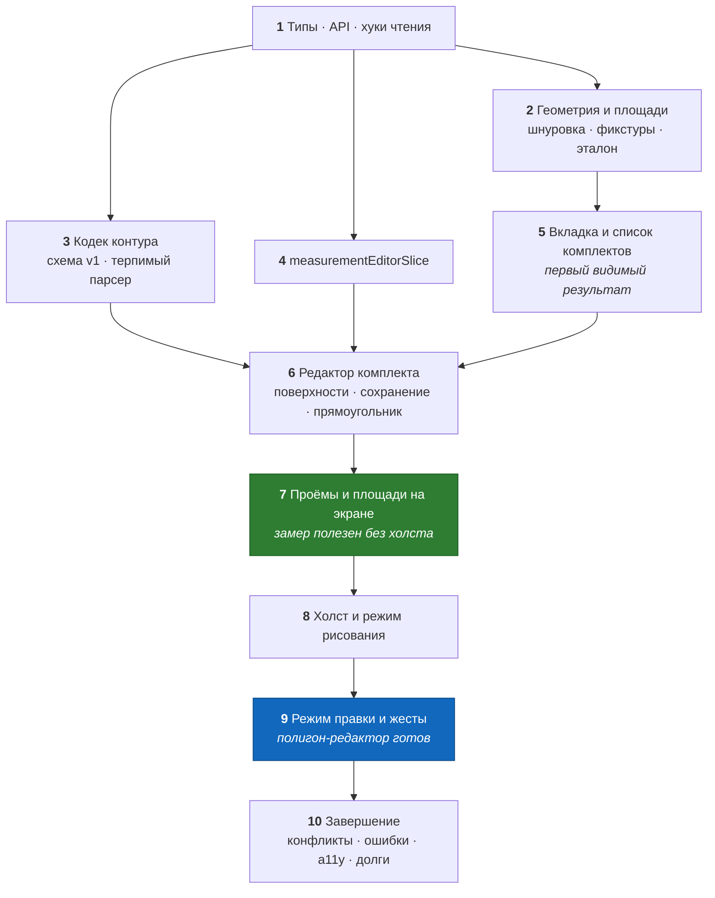

# PLANNING — Замер на вебе: пофазный план реализации

**Дата:** 13 августа 2026
**Область:** `web/` — фича «замер»: комплекты, поверхности, проёмы, полигон-редактор контура
**Основание:** [`DESIGN_MEASUREMENT.md`](./DESIGN_MEASUREMENT.md) — все решения (D1…D23) приняты
там, здесь только порядок работ · [`RESEARCH_MEASUREMENT.md`](./RESEARCH_MEASUREMENT.md) —
находки F-1…F-14 и риски R-1…R-6
**Образец плана:** [`../estimate/PLANNING_ESTIMATE.md`](../estimate/PLANNING_ESTIMATE.md)
**Бекенд:** готов, ни одной правки не требует

---

## Принцип разбиения

Каждая фаза — **отдельный завершённый коммит**, после которого проект собирается, линтер чист,
тесты зелёные, а результат проверяется руками в браузере. Если что-то из DESIGN попадает в фазу
частично, это записано явно с указанием закрывающей фазы.

Работа ведётся в ветке `feature/measurement-web`, по коммиту на фазу.

**Что у этого плана есть сверх обычного — два обстоятельства:**

1. **Порядок фаз выбран так, чтобы замер стал полезен до появления холста.** После фазы 7
   бригадир уже может завести комплект, поверхности с площадями, проёмы и получить чистую
   площадь — контур при этом задаётся прямоугольником по двум числам (D20) или площадь вводится
   руками (D9). Холст — фазы 8–9. Это страховка от главного риска плана: холст — самая
   объёмная и самая непредсказуемая часть (R-2), и она не должна блокировать остальное.
2. **Фазы 8 и 9 — перенос выстраданного кода, а не написание нового.** Приёмы L-1…L-6
   (`RESEARCH §7.3`) переносятся **вместе с комментариями**. Любое «упрощение» на этих фазах
   считается регрессией, пока не доказано обратное на реальном тач-устройстве.

---

## Что уже есть

Из клиента SNG наследуется и **не пишется заново**:

`apiFetch` с авто-refresh и `ApiError` (`src/utils/api.ts:116`) · `uuidv7()`
(`src/utils/uuid.ts:6`) · React Query и Redux store (`src/app/store.ts:11`) · `ProtectedRoute` ·
`ModalShell` (Esc, подложка, `role="dialog"`) · `ConfirmDeleteModal`,
`ConfirmDiscardDraftModal`, `SaveConflictModal` (последняя — с правкой пропсов, фаза 10) ·
`formatDateTime` (`src/features/projects/format.ts`) · вкладка «Замеры» уже стоит в `TABS`
(`ProjectDetailPage.tsx:20-25`).

Из фичи «смета» берётся **форма решения**, а не код: структура папок, разделение
`isDirty`/`treeDirty`, сборка тела одной функцией, guard конкурентной правки.

Из образца `home_build_client` переносится код: `geometry/*`, `canvas/*`, pointer-пайплайн
`RoomEditorStage`, защита от вершины-дубля в редьюсере.

**Сервер готов целиком** — одиннадцать ручек, `go test ./...` чист (`ADR-012`).

---

## Definition of Done — для каждой фазы

- [ ] `npm run type-check` — чисто;
- [ ] `npm run lint` и `npm run format:check` — чисто;
- [ ] `npm run test` — зелёный;
- [ ] новый поведенческий код покрыт тестами фазы (где применимо);
- [ ] сценарий «проверка руками» пройден **на 360 px и на десктопе**;
- [ ] для фаз 8–10 — дополнительно на **реальном тач-устройстве** (R-2);
- [ ] один осмысленный коммит, ветка остаётся рабочей.

---

## Карта фаз

| Фаза | Содержание | Коммит |
|---|---|---|
| 1 | типы, `measurement.api.ts`, хуки чтения, константы | `measurement: типы, api и хуки чтения` |
| 2 | шнуровка, самопересечение, углы, снап, площади + фикстуры | `measurement: геометрия и площади с фикстурами` |
| 3 | схема контура v1 и кодек см↔м | `measurement: кодек контура (схема v1)` |
| 4 | слайс черновика + регистрация в сторе | `measurement: слайс черновика замера` |
| 5 | вкладка, список комплектов, создание/удаление/порядок | `measurement: вкладка и список комплектов` |
| 6 | редактор комплекта, поверхности, `PUT`/`PATCH`, прямоугольник | `measurement: редактор комплекта и поверхности` |
| 7 | проёмы, чистая площадь, сводка по типам | `measurement: проёмы и расчёт площадей` |
| 8 | Konva, Stage, сетка, режим рисования | `measurement: холст контура и режим рисования` |
| 9 | режим правки, жесты, длины, углы, самопересечение, fit | `measurement: правка контура и жесты` |
| 10 | конфликт, ошибки, a11y, тач-прогон, правки чужих документов | `measurement: завершение — конфликты, ошибки, доступность` |

**Граф зависимостей:** `1 → {2, 3, 4}`, `{2} → 5`, `{3, 4, 5} → 6 → 7 → 8 → 9 → 10`.
Фазы 2, 3 и 4 после первой независимы и могут идти в любом порядке.

**Статус фаз (14.08.2026):** все десять фаз выполнены; каждая проверялась по DoD — type-check,
lint, format:check, тесты фазы, сценарий «проверка руками» на 360 px и десктопе (фазы 8–10 — на
тач-устройстве). Финальное сведение — `npm run type-check`, `npm run lint`, `npm run test`,
`npm run format:check`, `npm run build`.

---

## Фаза 1 — Типы, API-слой, хуки чтения

**Цель:** зафиксировать клиентский контракт ровно по `RESEARCH §4` и дать остальным фазам готовые
запросы.

**Файлы (NEW):**
- `src/features/measurement/types.ts` — `MeasurementTree`, `MeasurementSet`, `Surface`,
  `Opening`, `ScanSource`, `MeasurementSetInput`, `SurfaceInput`, `OpeningInput`,
  `MeasurementSetPatch`, `SurfacePatch`, `OpeningPatch`, `MEASUREMENT_LIMITS`;
- `src/features/measurement/constants.ts` — `SURFACE_TYPES` (константы + русские подписи),
  `SCAN_SOURCE_LABELS`, `OPENING_KIND_LABELS`, `OPENING_DEFAULTS`, `GRID_STEPS_CM`,
  `DEFAULT_GRID_STEP_CM = 10`, `SCALE_PX_PER_CM = 3`;
- `src/features/measurement/measurement.api.ts` — `getTree(projectId)`, `getSet(id)`,
  `putSet(id, body)`, `patchSet(id, patch)`, `removeSet(id)`;
- `src/features/measurement/measurement.hooks.ts` — `MEASUREMENT_QUERY_KEY`,
  `useGetMeasurementTree(projectId)`, `useGetMeasurementSet(id)`.

**Что делаем:**
- API-функции — тонкие обёртки над `apiFetch`, форма один в один с `estimates.api.ts`;
- ключи кэша — из `DESIGN §6.1`;
- `contour` в типах — `unknown | null`, **не** `object`: сервер его не проверял (F-5, §7.4);
- мутации **не пишем** — они появляются там, где их вызывают (фазы 5–6), иначе фаза кончается
  мёртвым кодом.

**Тесты:** нет (нет поведения).
**Проверка:** `npm run type-check && npm run lint`.
**Готово, когда:** типы компилируются, ни одного `any`, ни одного поля сверх контракта сервера
(`ownerId`, `rev`, `deletedAt` в типах отсутствуют).
**Риск:** соблазн объявить `type` как union из `SURFACE_TYPES` — это прямо запрещено решением 6
сервера (F-4): значение может быть любой строкой, включая набранную пользователем.

---

## Фаза 2 — Геометрия и площади

**Цель:** единственное место, где живёт геометрия, и фикстуры, которые переживут появление
второго клиента (F-10).

**Файлы (NEW):**
- `src/features/measurement/geometry/polygonArea.ts` — `polygonArea`, `polygonPerimeter`,
  `segmentLength` (перенос `home_build_client/src/geometry/polygonArea.ts`);
- `geometry/isSelfIntersecting.ts` — перенос образца целиком, включая обработку коллинеарных
  наложений;
- `geometry/computeAngle.ts` — перенос;
- `geometry/snapToGrid.ts` — `snapPointToGrid(point, stepCm)`;
- `geometry/rectangleContour.ts` — `rectangleContourCm(widthM, heightM)` → четыре вершины (D20);
- `utils/areas.ts` — `grossAreaM2`, `openingsDeductedM2`, `netAreaM2`, `summarizeByType`;
- `geometry/__fixtures__/polygon_area.json` — квадрат 4×3, невыпуклый, «Г»-образный,
  480-вершинный круг, вырожденный (2 точки);
- тесты: `polygonArea.test.ts`, `isSelfIntersecting.test.ts`, `snapToGrid.test.ts`,
  `areas.test.ts`.

**Что делаем:**
- координаты — **сантиметры** (D8), имена переменных несут единицу (`pointsCm`, `areaM2`);
- округление до двух знаков **один раз**, на границе см²→м² (`DESIGN §8.1`);
- `netAreaM2` не бывает отрицательной; `summarizeByType` группирует по строке **без нормализации
  регистра** (F-4).

**Тесты:** фикстуры + порядок обхода не влияет на знак площади; восьмёрка → самопересечение;
треугольник → нет; `deduct: false` не вычитается; `Стена` и `стена` — две разные группы.
**Проверка:** `npm run test`.
**Готово, когда:** формула площади существует в проекте **в одном экземпляре** и покрыта
фикстурами.
**Риск:** «оптимизировать» шнуровку под прямоугольник (`w × h`). Тогда у площади появится второй
вычислитель — ровно то, чего избегает `DESIGN §9.5`.

---

## Фаза 3 — Кодек контура

**Цель:** одно место, где происходит конвертация единиц и разбор чужого JSON.

**Файлы (NEW):**
- `src/features/measurement/contour/contourSchema.ts` — `ContourWireV1`, `EdgeSource`,
  `CONTOUR_SCHEMA_VERSION = 1`;
- `contour/contourCodec.ts` — `parseContour(raw: unknown): ContourDraft | null` (→ см, терпимо),
  `buildContour(draft: ContourDraft): ContourWireV1` (→ м, строго),
  `contourByteSize(wire): number`;
- `contour/contourCodec.test.ts`.

**Что делаем:**
- реализуем таблицу терпимости `DESIGN §7.4` целиком: `null`, мусор, `units:"cm"`, `lengthCm`,
  отсутствующий `edges`, `schemaVersion: 99`, `NaN` → `null`, < 3 вершин → `null`;
- `buildContour` пишет `units: "m"`, `lengthM` из вершин, `source` из `edgeSources`;
- контур < 3 вершин **не сериализуется никогда** — только `null` (F-5).

**Тесты:** round-trip на десяти контурах включая невыпуклый; каждая строка таблицы §7.4 —
отдельный случай; `contourByteSize` на 480-вершинном контуре < 32 КБ.
**Проверка:** `npm run test`; грепом убедиться, что `/100` и `* 100` встречаются **только** в
этом файле (`DESIGN §7.3`).
**Готово, когда:** ни один битый вход не приводит к исключению.
**Риск:** «строгий» парсер, падающий на незнакомых данных. Один битый контур не должен уносить
экран, где ещё девять целых комплектов.

---

## Фаза 4 — Слайс черновика

**Цель:** состояние редактора по `DESIGN §5`, включая секцию редактора контура (холста ещё нет —
секция уже есть).

**Файлы (NEW):**
- `src/features/measurement/measurementEditorSlice.ts`;
- `measurementEditorSlice.test.ts`.

**Файлы (EDIT):** `src/app/store.ts` — слайс в `combineSlices`.

**Что делаем:**
- состояние и все actions из `DESIGN §5.1`/`§5.3`;
- `isDirty` поднимается на любом изменении, `treeDirty` — только на касании поддерева
  (поверхности, проёмы, контур);
- `addPoint` **отбрасывает вершину, совпадающую с предыдущей** — перенос из
  `roomSlice.ts:26-45` вместе с комментарием (L-3);
- `commitContour` пишет в поверхность `contourCm` **и** `areaM2` одной операцией — иначе площадь
  разойдётся с контуром;
- `startNewDraft` чеканит `uuidv7()` в `prepare`, редьюсеры остаются чистыми (приём сметы).

**Тесты:** флаги после каждого action; дубль-вершина; `commitContour` обновляет обе величины;
`moveSurface` не теряет элементов; `resetEditor` возвращает `initialState`.
**Проверка:** `npm run test`.
**Готово, когда:** слайс покрыт тестами и зарегистрирован; ни один компонент его ещё не
использует — это нормально.
**Риск:** хранить `position` полем. Порядок — это индекс массива, `position` появляется только в
`buildSetBody` (фаза 6).

---

## Фаза 5 — Вкладка и список комплектов

**Цель:** первый видимый результат: замер проекта читается, комплект создаётся и удаляется.

**Файлы (NEW):**
- `src/components/measurement/MeasurementTab.tsx` — view-навигация (`list` / `set` / `contour`);
- `src/components/measurement/MeasurementSetList.tsx` — карточки комплектов, стрелки порядка,
  удаление, empty-state;
- `src/components/measurement/AreaSummary.tsx` — сводка площадей по типам (§8.3);
- `src/components/modals/MeasurementSetFormModal.tsx` — имя, заметка, `scanSource`;
- `src/components/modals/DeleteMeasurementSetModal.tsx`.

**Файлы (EDIT):**
- `src/features/projects/pages/ProjectDetailPage.tsx:147-149` — замена `ComingSoonTab` (D1);
- `measurement.hooks.ts` — добавляются `usePutMeasurementSet`, `usePatchMeasurementSet`,
  `useDeleteMeasurementSet`.

**Что делаем:**
- дерево читается одним `GET /projects/{id}/measurement`, из него же строится и список, и сводка;
- создание комплекта: модалка имени → `uuidv7()` → `PUT` с `surfaces: []` → открыть в редакторе
  (фаза 6; до неё — просто вернуться в список);
- порядок — стрелки, `PATCH {position}` двум соседям;
- удаление — модалка, `DELETE`, инвалидация дерева.

**Тесты:** нет обязательных (компоненты без своей логики); допустим smoke-рендер списка.
**Проверка руками:** пустой проект → «Создать комплект» → комплект появился → переименование →
порядок стрелками → удаление; на 360 px карточки не ломают вёрстку.
**Готово, когда:** вкладка «Замеры» перестала быть заглушкой и показывает реальные данные.
**Риск:** собрать тело `PUT` руками прямо в компоненте. Тело собирает **только** `buildSetBody`
(фаза 6); до неё создание комплекта отправляет литерал с явным `surfaces: []` — и этот литерал
удаляется в фазе 6.

---

## Фаза 6 — Редактор комплекта: поверхности и сохранение

**Цель:** комплект правится целиком и сохраняется; контур можно задать прямоугольником, не имея
холста.

**Файлы (NEW):**
- `src/features/measurement/utils/buildSetBody.ts` + `buildSetBody.test.ts`;
- `src/components/measurement/MeasurementSetEditor.tsx` — шапка, список поверхностей, панель
  сохранения;
- `src/components/measurement/SurfaceList.tsx`, `SurfaceRow.tsx` — таблица `lg+` / карточки;
- `src/components/modals/SurfaceFormModal.tsx` — тип (`<input list>`), имя, высота, площадь;
- `src/components/modals/RectangleContourModal.tsx` — контур по двум числам (D20).

**Что делаем:**
- развилка `PUT`/`PATCH` по `treeDirty` (`DESIGN §6.3`);
- `buildSetBody` — единственная сборка тела; ключи `surfaces`/`openings` присутствуют **всегда**
  (F-1), `position` = индекс, контур < 3 вершин → `null`;
- поле площади: при наличии контура — только чтение с подписью «из контура» (D9);
- числовые поля — строковый буфер + коммит по `onBlur` (D5);
- `scanSource` чужого комплекта не переписывается (D13);
- прямоугольник: ширина × высота → `rectangleContourCm` → `commitContour` — площадь считается
  шнуровкой, а не умножением (§9.5);
- уход из редактора при `isDirty` — `ConfirmDiscardDraftModal`; `beforeunload`.

**Тесты:** `buildSetBody.test.ts` — **первым случаем** «пустой список даёт `surfaces: []`, а не
отсутствующий ключ»; `position` = индекс; контур из двух точек → `null`.
**Проверка руками:** добавить три поверхности с разными типами (включая набранный руками
кириллицей), задать одной прямоугольник 4×3 → площадь 12 м²; сохранить; перезагрузить страницу —
всё на месте; удалить поверхность и сохранить — она исчезла и на сервере.
**Готово, когда:** замер проекта ведётся без единой строки Konva.
**Риск:** ветка «если поверхностей нет — не слать ключ». Это удаление данных у пользователя,
и тест обязан её ловить.

---

## Фаза 7 — Проёмы и площади на экране

**Цель:** замер становится полезным целиком: чистая площадь, вычеты, сводка.

**Файлы (NEW):**
- `src/components/measurement/OpeningsTable.tsx`;
- `src/components/modals/OpeningFormModal.tsx`.

**Файлы (EDIT):** `SurfaceRow.tsx` (раскрытие проёмов, три подписанные площади), `AreaSummary.tsx`
(чистая площадь в сводке).

**Что делаем:**
- проёмы: вид, ширина, высота, `deduct`, порядок; дефолт двери 0.9 × 2.05 с `deduct: true`;
- три подписанные величины у каждой поверхности (`DESIGN §8.2`), предупреждение «проёмы больше
  поверхности»;
- кнопка «⧉ скопировать площадь» — чистая площадь в буфер (D21);
- счётчики лимитов: `n / 200` поверхностей от 150, `n / 50` проёмов от 40.

**Тесты:** `areas.test.ts` дополняется случаем «проёмы больше поверхности → 0».
**Проверка руками:** стена 12.44 м² + дверь 0.9×2.05 с вычетом + окно без вычета → чистая
10.59 м²; снятие галочки `deduct` меняет число немедленно; «скопировать площадь» кладёт в буфер
`10.59`.
**Готово, когда:** пройден сценарий «бригадир завёл замер квартиры целиком, не открыв холст».
**Риск:** посчитать вычет от валовой площади **на сервере** (её там нет) или сохранить чистую
площадь в `areaM2`. `areaM2` — валовая, и это записано в трёх местах на сервере (F-3).

---

## Фаза 8 — Холст и режим рисования

**Цель:** контур рисуется мышью и пальцем.

**Файлы (NEW):**
- `src/components/measurement/contour/ContourEditorView.tsx` — экран (lazy-обёртка в
  `MeasurementTab`);
- `contour/ContourStage.tsx` — перенос `SimStage`: zoom колесом, pinch нативным `touchmove`
  с `{passive:false}`, `fitToBBox`, `getPointerCm`, `touchAction:"none"`;
- `contour/ContourGridLayer.tsx` — перенос `GridLayer` с LOD;
- `contour/ContourToolbar.tsx` — режим, шаг сетки, «⤢ Fit», «Замкнуть», «Готово».

**Файлы (EDIT):** `package.json` — `konva`, `react-konva`; `MeasurementTab.tsx` — `React.lazy`
+ `Suspense` (D18).

**Что делаем:**
- **draw-режим целиком**: тап по пустому полю → вершина со снапом; тап по первой при ≥ 3
  вершинах → замыкание и переход в edit; драг вершины → перенос; драг по пустому полю → pan;
- жесты — **только `pointer*`**, `draggable={false}`, порог 4 px, защита «жест уже идёт»
  (L-2, L-5); `preventDefault()` на `pointerdown`;
- bbox сетки = viewport ∪ bbox контура + запас (L-6);
- `ResizeObserver` на контейнер; коалесация трансформации через `requestAnimationFrame`;
- статус-строка: число вершин, периметр, площадь — считаются на лету;
- «Готово» вызывает `commitContour`, экран возвращается к комплекту; сервер не трогается (D4).

**Тесты:** автоматических нет — Konva рисует в canvas (`DESIGN §14`). Тесты фазы — на чистых
функциях, которые она использует (уже есть в фазах 2–3).
**Проверка руками (обязательно на тач-устройстве):** нарисовать пятиугольник, замкнуть; ни одной
«вершины-двойника» при быстрых тапах; pan не срабатывает при обычном клике; сетка не обрывается
при панорамировании к краю; пинч масштабирует, страница под пальцем не скроллится.
**Готово, когда:** контур рисуется и площадь в статус-строке совпадает с площадью в карточке
поверхности после «Готово».
**Риск:** переписать pointer-пайплайн «чище», потеряв L-1…L-6. Комментарии переносятся вместе с
кодом именно поэтому.

---

## Фаза 9 — Режим правки и жесты

**Цель:** полигон-редактор в объёме первой стадии образца.

**Файлы (NEW):**
- `contour/VertexHandle.tsx` (из `SimCornerHandle`);
- `contour/DimensionLabel.tsx` (из `SimDimensionLabel`);
- `contour/AngleLabel.tsx` (из `SimAngleLabel`).

**Файлы (EDIT):** `ContourEditorView.tsx` — edit-режим.

**Что делаем:**
- ручной поиск ближайшей вершины с допуском 32 экранных px вместо hit-test Konva (L-1);
- дельта драга в экранных px ÷ масштаб **на момент захвата** (L-4);
- подписи длин всех сторон; дуга и градусы при выделенной вершине; панель «Угол N: стороны и
  угол»;
- проверка самопересечения на коммите переноса → отклонение правки и сообщение (D15);
- удаление выделенной вершины (`Delete`, при ≥ 4 вершинах) с пересчётом `edgeSources` (D14);
- авто-`fitToBBox` при первом входе в edit-режим;
- `edgeSources`: перенос вершины помечает два смежных ребра `manual`, чужие пометки сохраняются.

**Тесты:** `measurementEditorSlice.test.ts` дополняется случаями `edgeSources` (перенос помечает
два ребра; удаление вершины схлопывает два ребра в одно `manual`).
**Проверка руками (тач):** две вершины рядом — драг захватывает ту, к которой ближе палец;
микро-пинч посреди драга не уносит точку; попытка сделать восьмёрку отклоняется с сообщением;
контур 30×30 м вписывается кнопкой Fit.
**Готово, когда:** первая стадия образца воспроизведена целиком, включая поведение на тач.
**Риск:** «умное» удаление вершины, меняющее форму (сглаживание). Удаление — это просто минус
вершина.

---

## Фаза 10 — Завершение

**Цель:** закрыть конкурентную правку, ошибки, доступность и долги в чужих документах.

**Файлы (EDIT):**
- `src/components/modals/SaveConflictModal.tsx` — обобщение пропсов до
  `{title, updatedAt, onRead, onOverwrite, onClose}`;
- `src/components/estimates/EstimateEditorView.tsx` — одна строка вызова под новые пропсы;
- `MeasurementSetEditor.tsx` — guard D11, обработка `404`/`413`/сетевых ошибок,
  «Сохранить как новый» (`regenerateDraftId`);
- `web/agentic_docs/CONVENTIONS.md` — упоминание, что `konva`/`react-konva` разрешены **только**
  внутри `src/components/measurement/contour/`.

**Файлы (EDIT, чужие документы — долги `DESIGN §17`):**
- `server_go/docs/features/measurement/DESIGN_MEASUREMENT.md §10` — вопрос 1 отменён, вопрос 2
  закрыт (площади считает веб, эталон — фикстуры фазы 2);
- `server_go/docs/ADR_012_Measurement_Decisions.md` — строка «Ручной ввод замера с веба» в
  «что осознанно отложено» приводится в соответствие.

**Что делаем:**
- контрольный `GET` перед `PUT`, `SaveConflictModal` с формулировкой, называющей цену
  «перезаписать» для трёхуровневого поддерева (§11.3);
- полный проход по таблицам `DESIGN §11.1` и `§11.2`;
- доступность: `aria-label` на иконочных кнопках, `Esc`/`Delete` в редакторе, размеры целей
  касания, ошибки текстом а не цветом;
- прогон всех сценариев на 360 px и на тач-устройстве;
- вычитка: ни одного `console.log`, ни одного `any`, ни одного `TODO` без ссылки на вопрос из
  `DESIGN §15`.

**Тесты:** сведение — `npm run test` целиком; ручной прогон чек-листа DoD.
**Проверка руками:** правка комплекта в двух вкладках → конфликт ловится; удаление комплекта в
одной вкладке и сохранение в другой → предложение «сохранить как новый», черновик не потерян.
**Готово, когда:** фича закрыта, долги в чужих документах закрыты, ADR-013 (если решим его
писать) — предмет отдельного решения, а не этого плана.

---

## Сквозные требования ко всем фазам

1. **Ни одной правки на сервере.** Если кажется, что нужна, — сначала перечитать `RESEARCH §3`:
   почти всегда «нужна» означает «клиент не туда посмотрел».
2. **Только Bootstrap.** Konva — исключение, и живёт исключительно в
   `src/components/measurement/contour/`.
3. **Единицы в имени переменной.** `pointsCm`, `areaM2`, `widthM`, `gridStepCm`. Конвертация —
   только в `contourCodec.ts` (проверяется грепом).
4. **`type` не нормализуется.** Ни `toUpperCase()`, ни `trim()` сверх обрезки пробелов по краям
   при вводе, ни сведение синонимов.
5. **Тело `PUT` собирает только `buildSetBody`.** Литерал тела в компоненте — регрессия.
6. **Комментарии образца переносятся вместе с кодом** (фазы 8–9).
7. Mobile-first: каждая фаза проверяется сначала на 360 px.

---

## Что этот план не покрывает

- симуляцию раскладки материала — вторая стадия образца, вне области (`DESIGN §16`);
- загрузку сырья скана (USDZ, mesh) — нет и не планируется;
- офлайн и `/sync` — отложены целиком;
- iOS-клиент SNG и согласование с ним схемы контура — триггер в `DESIGN §15`, пункт 1;
- маршрутизацию редактора через URL — апгрейд по первой жалобе (`DESIGN §15`, вопрос 7);
- bulk-ручку порядка комплектов — на сервере её нет, заводить ради стрелок не стоит
  (`DESIGN §15`, пункт 4).
