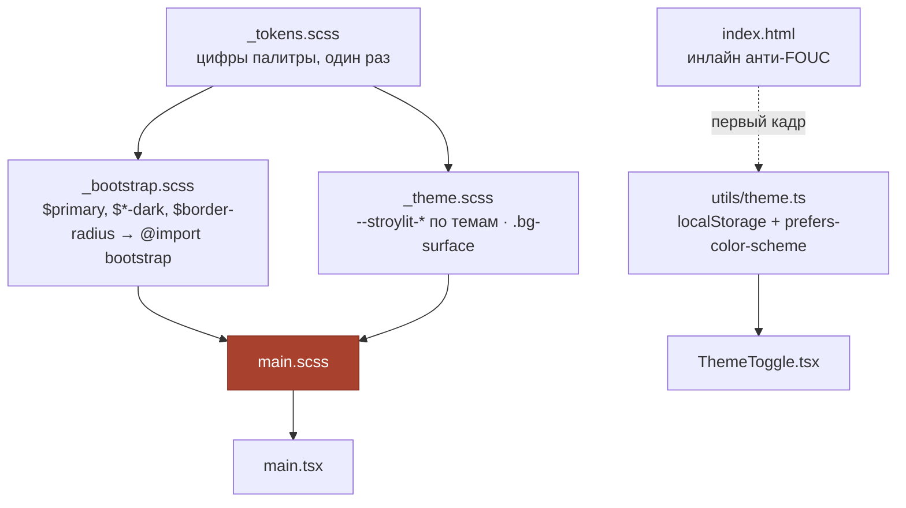

# DESIGN — Перенос дизайн-системы Stroylit на веб (redesign)

**Дата:** 17 августа 2026
**Область:** `stroylit_web/` — визуальный слой React-клиента
**Вход:** [`RESEARCH_REDESIGN.md`](./RESEARCH_REDESIGN.md) (карта артефактов, замеры, находки F-1…F-12)
**Источник дизайна:** [`Stroylit-design`](../../../Stroylit-design/) — `tokens/tokens.css`, `demo/style.css`
**Позиция веба:** дизайн разработан под мобильное приложение; веб — придаток, наследует
токены и не претендует на полное соответствие макетам

---

## 0. Ключевые решения (TL;DR)

| № | Решение | Почему |
|---|---|---|
| **D1** | Брендирование через **Sass-компиляцию Bootstrap**, а не через переопределение `--bs-*` | F-4: `.btn-primary` жёстко задаёт `--bs-btn-bg:#0d6efd` и ещё 12 переменных; 16 вариантов кнопок × 12 переменных против 8 строк `$`-переменных |
| **D2** | `--color-error` уводится в **холодный красный `#C42350`** (тон 343°) | F-3: ΔE76 к акценту растёт 21.8 → **27.8**; контраст на белом 4.55 → **5.67** |
| **D3** | AA чинится **добавлением тона `*-text-emphasis`**, базовые цвета дизайна не трогаются | F-2: дизайн задаёт пару `color` + `soft` и не задаёт третий тон; Bootstrap 5.3 его требует и всё равно сгенерирует свой |
| **D4** | `--bs-secondary-color` = дизайновый **`text-secondary #6B655C`**, а `text-muted #9B948A` → `--bs-tertiary-color` | `.text-muted` (114 использований) раскрывается в `--bs-secondary-color`; так все 114 мест разом получают контраст 5.40 вместо 2.81 — **без правки компонентов** |
| **D5** | Тёмная палитра **выводится нами** и фиксируется в токенах как часть системы | F-3 research-вопрос 3: дизайн не даёт ни одного значения, ждать нечего — веб придаток |
| **D6** | Тема переключается атрибутом `data-bs-theme` на `<html>`, выбор в `localStorage`, старт — из `prefers-color-scheme`. Сам блок `[data-bs-theme=dark]` **генерирует Bootstrap** из переменных `$*-dark` | штатная механика 5.3; своего слоя тем не пишем вовсе — в 5.3 есть `_variables-dark.scss`, где все значения объявлены через `!default` |
| **D7** | Анти-FOUC — **синхронный инлайн-скрипт в `<head>`** до загрузки бандла | иначе первый кадр всегда светлый, и это заметно |
| **D8** | 13 мест на `bg-white`/`bg-light` **правятся точечно** в компонентах, а не подменяются в Sass; для замены `bg-white` заводится своя тема-зависимая утилита `.bg-surface` | F-5; подмена `.bg-white` сделала бы класс не-белым — ложь в имени дороже 13 однословных правок. `.bg-body` не подходит: это фон страницы (`#FAF7F4`), а нужен фон поверхности (`#FFFFFF`) |
| **D8a** | Навбар **остаётся тёмным в обеих темах**: `bg-dark` сохраняется (это брендовый `navy #2B211B`), устаревший `navbar-dark` заменяется на `data-bs-theme="dark"` на самом `<nav>` | правка внутренностей навбара (`text-light`, `btn-outline-light` — 4 места) не нужна, а тёмная шапка над светлым контентом остаётся читаемой в обеих темах |
| **D9** | **Шкала `$spacers` не переопределяется** (0…5 сохраняют смысл), добавляется только ключ `6: 2rem` | ремап сдвинул бы каждый `p-3`/`mb-4` во всех 161 файлах; 12px из дизайна остаётся без утилиты |
| **D10** | `$border-width: 1.5px` глобально, но `$table-border-width: 1px` | 1.5px — часть узнаваемости дизайна, но на таблице сметы в 40 строк даёт визуальный шум |
| **D11** | `.card` и `.modal-content` **явно** привязываются к `--stroylit-surface`, а не к `--bs-body-bg` | F-10: в дизайне фон страницы `#FAF7F4` ≠ фон карточки `#FFFFFF`; по умолчанию они бы слились |
| **D12** | Иконки остаются `bootstrap-icons`, stroke-набор дизайна не переносится | F-7: два набора в одном интерфейсе хуже, чем расхождение с макетом |
| **D13** | Лендинг (`index.css`, ~1150 строк) и контурный редактор на Konva **выводятся из области** | лендинг — чужой визуальный мир (`FUENEX`, синяя палитра); Konva-цвета в CSS недостижимы (F-12) |
| **D14** | Геометрия подтягивается **частично**: радиусы, толщина рамки, высота контролов. Композиция (сайдбар 260px, карточки вместо таблиц) — **нет** | веб — придаток; переезд на сайдбар-каркас это отдельная продуктовая работа, а не перекраска |
| **D15** | Токены живут в `src/styles/_tokens.scss` и дублируются в `:root` как `--stroylit-*` | Sass нужен до компиляции, CSS-переменные — для рантайма (тёмная тема, Konva-мост, будущие компоненты) |

---

## 1. Итоговая палитра

### 1.1 Что изменилось относительно `tokens/tokens.css`

| Токен | Было | Стало | Причина |
|---|---|---|---|
| `--color-error` | `#D93A3A` | **`#C42350`** | D2 — уход в холодный красный |
| `--color-error-soft` | `#FBE4E4` | **`#FAE3E9`** | согласование с новым тоном |
| `*-emphasis` (5 шт.) | — | **добавлены** | D3 — без них AA не проходит |
| `*-border-subtle` (5 шт.) | — | **добавлены** | бесплатно генерируется Bootstrap, дизайн их не запрещает |
| тёмная тема (24 значения) | — | **добавлена** | D5 |

Всё остальное — поверхности, текст, акцент, `navy`, `success`/`warning`/`info`, цвета каналов,
радиусы, отступы, шрифт — **перенесено дословно**.

### 1.2 Светлая тема

| Роль | Значение | Проверка |
|---|---|---|
| `bg` | `#FAF7F4` | — |
| `surface` | `#FFFFFF` | — |
| `surface-muted` | `#F2EDE8` | — |
| `border` | `#E3DCD3` | — |
| `text-primary` | `#241F19` | 15.31 на `bg` ✅ |
| `text-secondary` | `#6B655C` | 5.40 на `bg` ✅ |
| `text-muted` | `#9B948A` | 2.81 — **только декоративное**, см. D4 |

| Семантика | base | bg-subtle | border-subtle | text-emphasis | emphasis на subtle |
|---|---|---|---|---|---|
| primary | `#A8412E` | `#F5E0DA` | `#DCB3AB` | `#8C3222` | **6.38** ✅ |
| danger | `#C42350` | `#FAE3E9` | `#E7A7B9` | `#9D1C40` | **6.44** ✅ |
| success | `#2E9E5B` | `#E1F3E7` | `#ABD8BD` | `#237A46` | **4.61** ✅ |
| warning | `#C8790F` | `#FBEBD4` | `#E9C99F` | `#985C0B` | **4.63** ✅ |
| info | `#2B7FD9` | `#E2EEFC` | `#AACCF0` | `#246BB6` | **4.64** ✅ |

Было до правки: 2.89 / 2.95 / 3.48 / 3.75. Стало — все пять ≥ 4.5.

### 1.3 Тёмная тема (выведена, D5)

Принцип вывода: сохранить **тёплый** характер палитры (это «стройка»: песок, кирпич, бетон),
а не уезжать в нейтральный серый; акцент и семантику поднимать по светлоте в HLS с сохранением
насыщенности, а не подмешивать белый (иначе цвета выцветают).

| Роль | Значение | Проверка |
|---|---|---|
| `bg` | `#14100D` | — |
| `surface` | `#221C17` | 1.12 к `bg` — как в штатной тёмной теме Bootstrap, разделение держит рамка |
| `surface-muted` | `#2E2721` | — |
| `border` | `#413830` | 1.47 к `surface` ✅ |
| `text-primary` | `#F2EDE7` | 14.48 на `surface` ✅ |
| `text-secondary` | `#B5ADA2` | 7.59 ✅ |
| `text-muted` | `#8B8378` | 4.51 ✅ |

| Семантика | bg-subtle | border-subtle | text-emphasis | на subtle / на surface |
|---|---|---|---|---|
| primary | `#42251D` | `#5A2C21` | `#D77F6F` | 4.73 / 5.74 ✅ |
| danger | `#491E25` | `#661F2F` | `#E56D8F` | 4.62 / 5.55 ✅ |
| success | `#253B27` | `#275334` | `#35B669` | 4.64 / 6.46 ✅ |
| warning | `#4A3215` | `#684314` | `#E98D11` | 4.71 / 6.64 ✅ |
| info | `#243446` | `#264668` | `#63A1E3` | 4.68 / 6.21 ✅ |

**Заливки кнопок в тёмной теме не меняются** — Bootstrap 5.3 не делает `.btn-*` тема-зависимыми,
и это правильно: белый на `#A8412E` даёт 6.07 в обеих темах, акцент остаётся узнаваемым.

### 1.4 Цвета каналов связи

`telegram #27A7E7`, `max #8C5CF5`, `email #5B7083` переносятся **без изменений в обеих темах** —
это узнаваемость бренда мессенджера, а не часть нашей палитры (прямое указание
`Palette_Options.md:152`).

---

## 2. Почему `#C42350`, а не что-то ещё (D2)

Кандидаты мерялись по трём критериям: расстояние до акцента (ΔE76), контраст на белом
(он же — контраст белого текста на кнопке `btn-danger`), и то, чтобы цвет ещё читался как
«ошибка».

| Кандидат | Тон | Контраст на белом | ΔE76 к `#A8412E` |
|---|---|---|---|
| `#D93A3A` (было) | 0° | 4.55 | 21.8 |
| `#D02B4C` | 348° | 5.08 | 25.4 |
| `#C7314F` | 348° | 5.28 | 23.4 |
| `#BE1E4A` | 344° | 6.04 | 26.3 |
| **`#C42350`** | **343°** | **5.67** | **27.8** |

`#C42350` даёт максимальное расстояние до акцента при контрасте в комфортном окне 5–6 (выше —
цвет темнеет и снова начинает походить на кирпич). Дальше 343° уходить нельзя: на 335° и ниже
цвет перестаёт читаться как «ошибка» и начинает читаться как «розовый акцент».

Побочный эффект: подложки `accent-soft #F5E0DA` и `error-soft #FAE3E9` разошлись на ΔE 6.4 —
рядом различимы, но это самая тонкая пара в системе. Если бейдж «Смета отправлена» окажется
рядом с бейджем ошибки — проверить глазами.

---

## 3. Архитектура стилей

### 3.1 Карта файлов

```
src/styles/
├── _tokens.scss        # все токены обеих тем; ничего не печатает в CSS
├── _bootstrap.scss     # $-переопределения (светлые и $*-dark) → @import bootstrap
├── _theme.scss         # --stroylit-* по темам, утилита .bg-surface, изоляция лендинга
└── main.scss           # точка входа: @use bootstrap, theme
src/utils/theme.ts      # чтение/запись/применение темы (без React)
src/components/ThemeToggle.tsx
```



Порядок в `main.scss` критичен: токены → Bootstrap → наш слой тем. Слой тем идёт **после**
Bootstrap, потому что переопределяет уже сгенерированные им переменные.

### 3.2 Точка подключения

```
src/main.tsx:7–9

- import "bootstrap/dist/css/bootstrap.min.css"
  import "bootstrap-icons/font/bootstrap-icons.css"
  import "./index.css"
+ import "./styles/main.scss"
```

`index.css` остаётся на месте и подключается **после** — в нём живёт лендинг (D13). Порядок
важен: лендинг обязан оставаться визуально нетронутым.

### 3.3 Sass в сборке

`sass-embedded` в `devDependencies`; Vite 6 подхватывает `.scss` без плагинов. Bootstrap 5.3.8
внутри использует `@import` и старые цветовые функции — с Dart Sass 1.80+ это поток
deprecation-предупреждений (F-6), который глушится в `vite.config.ts`:

```ts
css: {
  preprocessorOptions: {
    scss: {
      silenceDeprecations: ["import", "global-builtin", "color-functions", "if-function"],
      loadPaths: ["node_modules"],
    },
  },
}
```

Это глушение **чужих** предупреждений, а не своих: свой код на `@use`. Без него сборка выдаёт
78+ предупреждений из `bootstrap/scss/_functions.scss` и своих в них не видно. Снимать, когда
Bootstrap переедет на модульную систему Sass (ожидается в 6.x). `loadPaths` нужен, чтобы
`@import "bootstrap/scss/bootstrap"` резолвился без префикса `~`.

---

## 4. Маппинг токенов на Bootstrap

### 4.1 Цвет

| Токен дизайна | Sass-переменная | Что перекрашивает |
|---|---|---|
| `accent #A8412E` | `$primary` | кнопки, ссылки, фокус-кольцо, активные пункты, чекбоксы |
| `accent-dark #8C3222` | `$primary-text-emphasis` | текст на акцентной подложке |
| `accent-soft #F5E0DA` | `$primary-bg-subtle` | «следующий шаг», выделенные строки |
| `bg #FAF7F4` | `$body-bg` | фон страницы |
| `surface #FFFFFF` | `$card-bg`, `$modal-content-bg`, `$input-bg`, `$list-group-bg`, `$dropdown-bg`, `$offcanvas-bg-color` — все как `var(--stroylit-surface)` (D11) | карточки, модалки, поля ввода, списки, выпадашки |
| `surface-muted #F2EDE8` | `$secondary-bg` (`.bg-body-secondary`) | вторичные плашки |
| `border #E3DCD3` | `$border-color` | все рамки |
| `text-primary #241F19` | `$body-color` | основной текст |
| `text-secondary #6B655C` | `$secondary-color` (D4) | `.text-muted` — 114 мест |
| `text-muted #9B948A` | `$tertiary-color` | плейсхолдеры, disabled |
| `navy #2B211B` | `$dark` | плашка «Итого», навбар |
| `success/warning/error/info` | `$success/$warning/$danger/$info` | семантика целиком |

Цвета каналов в Bootstrap не отображаются — живут только как `--stroylit-telegram` и т.д.

### 4.2 Геометрия (D14)

| Токен | Sass | Значение | Дефолт Bootstrap |
|---|---|---|---|
| `radius-s 10px` | `$border-radius` | `.625rem` | `.375rem` |
| `radius-m 16px` | `$border-radius-lg` | `1rem` | `.5rem` |
| `radius-l 22px` | `$border-radius-xl` | `1.375rem` | `1rem` |
| — | `$border-radius-sm` | `.5rem` | `.25rem` |
| рамка 1.5px | `$border-width` | `1.5px` | `1px` |
| рамка таблицы (D10) | `$table-border-width` | `1px` | `1px` |
| высота контрола 44–48px | `$input-btn-padding-y` | `.625rem` | `.375rem` |
| Inter | `$font-family-base` | `"Inter", system-ui, …` | системный стек |
| отступ 32px (D9) | `$spacers` ключ `6` | `2rem` | ключа нет |

Расчёт высоты контрола: `24px` (line-height 1.5 × 16px) + `2×10px` padding + `2×1.5px` рамка =
**47px**, попадает в окно 44–48px из `demo/style.css:50`.

### 4.3 Чего в маппинге сознательно нет

Типографическая шкала заголовков (`$h1…$h6`), плотность таблиц, `$grid-gutter-width`, ширины
контейнеров — **не трогаются**. Дизайн даёт эти значения для мобильных экранов 390px, перенос
их на десктоп сломал бы существующие раскладки без выигрыша.

### 4.4 Пропуск в маппинге: `$font-family-monospace` (F-13, закрыт) — **решён, принят вариант 1**

Переопределена только `$font-family-sans-serif`. Моноширинное семейство осталось дефолтом
Bootstrap, и на нём были набраны **11 денежных мест в 6 файлах** (перечень — в RESEARCH F-13),
включая «ИТОГО брутто». В дизайне моноширинного нет вообще.

**Решение (вопрос 8, §7):** `$font-family-monospace: t.$font-stack` в `_bootstrap.scss`
(одна строка) + `font-variant-numeric: tabular-nums` на утилите `.font-monospace` в
`_theme.scss` (одно правило). Разметка не тронута — 11 мест продолжают стоять на `.font-monospace`, но гарнитура у них теперь единая с остальным интерфейсом, а выравнивание разрядов в таблице сметы держится на tabular-nums. Проверено в собранном CSS: `--bs-font-monospace` раскрывается в Inter, `.font-monospace` дополнительно получает tabular-nums.

---

## 5. Тёмная тема

### 5.1 Механика (D6)

```
<html data-bs-theme="light|dark">
```

Один атрибут на корне. Блок `[data-bs-theme="dark"]` для штатных `--bs-*` **генерирует сам
Bootstrap** — в 5.3 есть `_variables-dark.scss`, где все значения объявлены через `!default`,
поэтому достаточно задать `$body-bg-dark`, `$*-bg-subtle-dark`, `$*-text-emphasis-dark` и т.д.
до `@import`. Руками в `_theme.scss` пишутся только наши `--stroylit-*`.

Состояния три, хранится два:

| Состояние | `localStorage["stroylit-theme"]` | Атрибут |
|---|---|---|
| системная (по умолчанию) | ключа нет | из `prefers-color-scheme` |
| выбрана светлая | `"light"` | `light` |
| выбрана тёмная | `"dark"` | `dark` |

Пока ключа нет, приложение слушает `matchMedia("(prefers-color-scheme: dark)")` и следует за
системой. Первое же нажатие переключателя фиксирует выбор и отписывает от системы.

### 5.2 Анти-FOUC (D7)

Инлайн-скрипт в `<head>` до `<script type="module">` — синхронный, без зависимостей:

```html
<script>
  (function () {
    try {
      var s = localStorage.getItem("stroylit-theme")
      var d = s || (matchMedia("(prefers-color-scheme: dark)").matches ? "dark" : "light")
      document.documentElement.setAttribute("data-bs-theme", d)
    } catch (e) { /* приватный режим — остаёмся на светлой */ }
  })()
</script>
```

Без него первый кадр всегда светлый: React ставит атрибут только после гидрации.

### 5.3 Что чинится в компонентах (D8)

13 мест из F-5, замена однословная:

| Файл | Было | Стало |
|---|---|---|
| `App.tsx:23` | `bg-light` | `bg-body-tertiary` |
| `App.tsx:26` | `bg-white` | `bg-surface` |
| `estimates/CatalogManager.tsx:116` | `bg-white` | `bg-surface` |
| `estimates/EstimateItemsTable.tsx:176` | `bg-white` | `bg-surface` |
| `estimates/EstimateTotalsSummary.tsx:106` | `bg-light` | `bg-body-tertiary` |
| `measurement/MeasurementSetEditor.tsx:309` | `bg-white` | `bg-surface` |
| `measurement/SurfaceList.tsx:128` | `bg-light` | `bg-body-tertiary` |
| `modals/SelectCatalogItemsModal.tsx:124` | `bg-white` | `bg-surface` |
| `modals/SelectTaskCatalogItemsModal.tsx:101` | `bg-white` | `bg-surface` |
| `planner/TaskCatalogManager.tsx:118` | `bg-white` | `bg-surface` |
| `planner/TaskListTable.tsx:223` | `bg-white` | `bg-surface` |
| `auth/pages/ProfilePage.tsx:628` | `bg-light` | `bg-body-tertiary` |
| `projects/pages/ProjectsPage.tsx:61` | `bg-white` | `bg-surface` |

Семь из девяти `bg-white` — один и тот же `input-group-text` рядом с полем поиска.

`.bg-surface` — своя утилита в `_theme.scss` (D8), потому что штатного тема-зависимого
эквивалента белого фона поверхности в Bootstrap нет: `.bg-body` даёт фон страницы,
`.bg-body-secondary` — приглушённую плашку. Значение то же, что у `$input-bg`, поэтому
`input-group-text` совпадает с полем ввода пиксель в пиксель в обеих темах.

**Навбар — исключение (D8a).** `bg-dark` остаётся: после маппинга `$dark` это брендовый
`navy #2B211B`, а не серый Bootstrap. Убирается только устаревший `navbar-dark`, вместо него
`data-bs-theme="dark"` на самом `<nav>` — так внутренние `text-light` и `btn-outline-light`
(4 места) продолжают работать без правок.

### 5.4 Что остаётся светлым и это осознанно

- **Лендинг и страница приватности** — свой визуальный мир с захардкоженной синей палитрой
  (`index.css`, ~1150 строк). Фон задан явно (`.landing-page { background: #ffffff }`), поэтому
  переключение темы их не затрагивает.
- **Контурный редактор на Konva** — 15 цветов передаются в канвас строками (F-12). Останется
  светлым островом внутри тёмного интерфейса. Допустимо: это рабочая плоскость с сеткой,
  аналог листа бумаги. Мост через `--stroylit-*` возможен позже, в область не входит.

---

## 6. Что проверить глазами после внедрения

Автотестами это не ловится, порядок обхода:

1. **Модалка удаления** — `btn-primary` и `btn-danger` рядом (ради этого делался D2).
2. **Статусные бейджи** в обеих темах — самая тонкая пара `accent-soft` / `error-soft` (§2).
3. **Поле поиска** с `input-group-text` — семь одинаковых мест, где чинился `bg-white`.
4. **Таблица сметы** на 30+ строк — проверка D10 (рамка 1px против 1.5px).
5. **Первый кадр при перезагрузке** в тёмной теме — работает ли D7.
6. **Лендинг** — не должен измениться вообще ничем.
7. **Контурный редактор** в тёмной теме — светлый остров ожидаем, но не должен «мигать».
8. **Денежные суммы** рядом с обычным текстом («ИТОГО брутто», итог в списке смет) — видно ли,
   что они набраны другой гарнитурой (F-13, §4.4).

Проход 17 августа 2026 закрыл только частично: светлая тема, узкий вьюпорт (таблица сметы
рендерилась карточной веткой `d-lg-none`, а не таблицей). Пункты 1, 3, 4, 5, 7 остаются
непроверенными; пункт 8 этим проходом и обнаружен.

---

## 7. Ответы на открытые вопросы RESEARCH

| № | Вопрос | Решение |
|---|---|---|
| 1 | Какой холодный красный | `#C42350`, обоснование в §2 (D2) |
| 2 | Чинить AA тоном или базовыми цветами | тоном `*-text-emphasis` — дизайн не трогаем (D3), плюс D4 закрывает 114 мест разом |
| 3 | Откуда тёмная палитра | выводим сами, §1.3 (D5); дизайнеру отдаётся как готовое предложение |
| 4 | Править компоненты или подменять утилиты | править компоненты — 14 однословных замен (D8) |
| 5 | Насколько глубоко геометрия | радиусы, рамка, высота контролов — да; композиция — нет (D14) |
| 6 | Что делать с лендингом | вывести из области (D13) |
| 7 | Как переключается тема | `data-bs-theme` + `localStorage` + `prefers-color-scheme`, кнопка в навбаре (D6, D7) |
| 8 | Деньги: Inter + `tabular-nums` или моноширинный | **закрыт 17 августа 2026 — принят вариант 1.** `$font-family-monospace: t.$font-stack` в `_bootstrap.scss` (одна строка) + `font-variant-numeric: tabular-nums` на `.font-monospace` в `_theme.scss` (одно правило). Разметка не тронута; выравнивание разрядов в таблице сметы держится на tabular-nums. В собранном CSS `--bs-font-monospace` раскрывается в Inter, см. §4.4 |

---

## 8. Состояние на 17 августа 2026

Реализовано и проверено:

| Что | Где | Проверка |
|---|---|---|
| Sass в сборке | `package.json` (`sass-embedded`), `vite.config.ts` | сборка чистая, ноль предупреждений |
| Токены | `src/styles/_tokens.scss` | — |
| Брендирование Bootstrap | `src/styles/_bootstrap.scss` | в собранном CSS `.btn-primary{--bs-btn-bg:#A8412E}`, `.btn-danger{--bs-btn-bg:#C42350}` |
| Тёмная тема | там же, `$*-dark` | в CSS есть `[data-bs-theme=dark]{--bs-body-bg:#14100D;…}` |
| Рантайм-токены | `src/styles/_theme.scss` | `--bs-card-bg: var(--stroylit-surface)`, `--bs-modal-bg: var(--stroylit-surface)` |
| Переключатель | `src/utils/theme.ts`, `src/components/ThemeToggle.tsx` | кнопка в навбаре |
| Анти-FOUC | `index.html` | инлайн-скрипт до бандла |
| 13 замен классов | §5.3 | `bg-white`/`bg-light` в `.tsx` больше не встречаются |
| Моноширинное уведено на Inter (F-13) | `_bootstrap.scss` (`$font-family-monospace`), `_theme.scss` (`.font-monospace` → `tabular-nums`) | в собранном CSS `--bs-font-monospace` раскрывается в Inter, `.font-monospace` получает `font-variant-numeric: tabular-nums` |

Регрессий нет: **182 теста в 23 файлах** проходят, `tsc` без ошибок, ESLint на изменённых
файлах чист (5 ошибок в `LandingPage.tsx` и 4 предупреждения в `ContourStage.tsx` были до
работы и её не касаются).

Остаётся `--bs-blue: #0d6efd` в `:root` — это сырая палитра Bootstrap, ни один компонент её не
читает.

Открыто: `$font-family-monospace` не переопределён (F-13, §4.4) — 11 денежных мест набраны
системным моноширинным. Обнаружено при сверке с `demo-web.html` уже после внедрения; решение
не принято, см. вопрос 8 в §7.

**Закрыто этим же днём, после внедрения:** принят вариант 1 (вопрос 8, §7) —
`$font-family-monospace` уведён на `$font-stack`, `.font-monospace` получает
`font-variant-numeric: tabular-nums`. 11 денежных мест продолжают стоять на `.font-monospace`
без правки разметки, но набраны теперь Inter.

Не проверено автоматикой и требует прохода глазами — см. §6.

---

## 9. Что эта работа сознательно не делает

- **не переносит композицию макетов** — сайдбара 260px, карточек вместо таблиц, «живой
  корзины» здесь нет. Это продуктовая работа, а не перекраска (D14);
- **не восполняет пробелы дизайна** (F-8) — обмеры, контурный редактор, плотные таблицы,
  планировщик остаются без макетов и просто наследуют новые цвета;
- **не переводит иконки** на stroke-набор дизайна (D12);
- **не трогает лендинг** (D13) — включая его синюю палитру в `index.css:1–6`;
- **не решает self-host шрифта** (F-11) — долг зафиксирован, Inter продолжает грузиться с
  Google Fonts;
- **не меняет разметку и логику компонентов** — кроме 14 замен классов из §5.3;
- **не добавляет тестов на цвет** — палитра проверяется расчётом (числа в §1) и глазами (§6);
  снапшоты цветов в CI дали бы ложную уверенность и постоянные ложные срабатывания.
