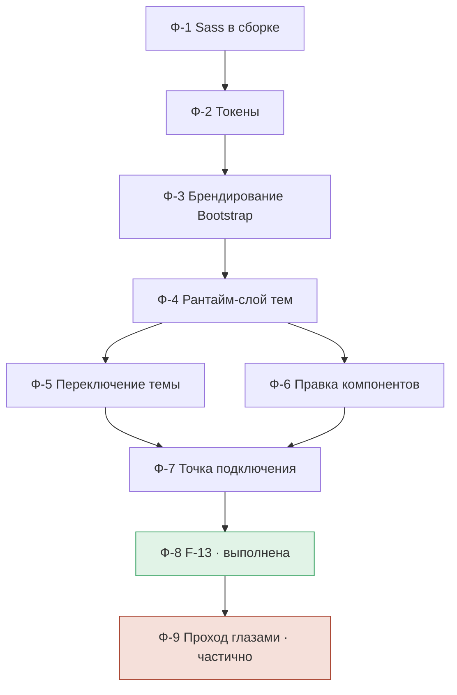

# PLANNING — Перенос дизайн-системы Stroylit на веб (redesign)

**Дата:** 17 августа 2026
**Область:** `stroylit_web/` — визуальный слой React-клиента
**Вход:** [`RESEARCH_REDESIGN.md`](./RESEARCH_REDESIGN.md) (находки F-1…F-13),
[`DESIGN_REDESIGN.md`](./DESIGN_REDESIGN.md) (решения D1…D15)
**Цель документа:** разбить работу на фазы, зафиксировать порядок и зависимости между ними и
назвать критерий готовности каждой. Ни находок, ни решений здесь не появляется — на них
ссылаются.

> Третий документ тройки. `RESEARCH` §9 явно оставил разбивку на фазы этому документу.

---

## 0. Состояние на дату

Перекраска **выполнена**. Проверено прогоном на 17 августа 2026:

| Проверка | Результат |
|---|---|
| Тесты клиента | 182 теста в 23 файлах — проходят |
| `tsc` | ошибок нет |
| `bg-white` / `bg-light` в `.tsx` | 0 вхождений (было 13) |
| `.bg-surface` | 9 мест |
| Файлы стилей | `_tokens.scss`, `_bootstrap.scss`, `_theme.scss`, `main.scss` — на месте |
| Анти-FOUC | инлайн-скрипт в `index.html` присутствует |

Открытым остаётся хвост из двух фаз (§3): Ф-8 закрыта решением и правками 17 августа,
Ф-9 — частично (семь пунктов из восьми ждут прохода глазами на десктопной ширине в обеих темах).

---

## 1. Границы планирования

**Этот документ планирует** остаток работ по переносу дизайн-системы: типографический пропуск,
проверку глазами и зафиксированные долги.

**Этот документ не планирует композицию.** Перенос сайдбар-каркаса, хаба заказа, «живой
корзины» и работы с этапами выведен решением **D14** за пределы перекраски и живёт отдельно —
как openspec change `redesign-web-composition` в репозитории `Stroylit-docs`. Там свои
proposal, спеки, design и 33 задачи. Дублировать их здесь нельзя: два плана на одну работу
расходятся на первой же правке.

Разделение проходит по одной черте: **перекраска не меняет разметку и логику компонентов**
(`DESIGN` §9), композиция меняет только их. Пересечение — пустое.

---

## 2. Фазы выполненной работы

> **Это реконструкция по артефактам, а не журнал.** Порядок ниже выведен из зависимостей между
> файлами и решениями; он объясняет, почему работа устроена так, как устроена, и в каком порядке
> её пришлось бы повторять на другом клиенте. Утверждать, что работа шла именно этими шагами,
> документ не может — он написан после неё.

Порядок задан жёстко и не переставляется: каждая следующая фаза читает то, что напечатала
предыдущая.

### Ф-1. Компилятор Sass в сборке

**Почему первой.** Без компилятора ни одна `$`-переменная не существует, а брендирование
Bootstrap возможно только через них (**F-4**, **D1**).

Содержание: `sass-embedded` в `devDependencies`; `silenceDeprecations` и `loadPaths` в
`vite.config.ts` (**F-6**).

**Критерий готовности:** сборка проходит, предупреждений от Bootstrap в консоли нет, свои
предупреждения видны.

### Ф-2. Токены

**Зависит от:** Ф-1.

Содержание: `_tokens.scss` — цифры обеих палитр в одном месте, включая выведенную тёмную
(**D5**) и уведённый холодный красный (**D2**). Файл ничего не печатает в CSS.

**Критерий готовности:** значения совпадают с `DESIGN` §1; файл не даёт вывода в собранном CSS.

### Ф-3. Брендирование Bootstrap

**Зависит от:** Ф-2 — читает токены как `$`-переменные.

Содержание: `_bootstrap.scss` — переопределения светлой палитры, `$*-dark` для тёмной, геометрия
(**D9**, **D10**, **D14**), затем `@import` Bootstrap.

**Критерий готовности:** в собранном CSS `.btn-primary{--bs-btn-bg:#A8412E}` и
`.btn-danger{--bs-btn-bg:#C42350}`; блок `[data-bs-theme=dark]` сгенерирован Bootstrap, а не
написан руками (**D6**).

### Ф-4. Рантайм-слой тем

**Зависит от:** Ф-3 — переопределяет переменные, которые Bootstrap уже сгенерировал, поэтому
идёт строго после него в `main.scss`.

Содержание: `_theme.scss` — `--stroylit-*` по темам, привязка `.card` и `.modal-content` к
поверхности (**D11**), утилита `.bg-surface` (**D8**), изоляция лендинга (**D13**).

**Критерий готовности:** `--bs-card-bg` разрешается в `--stroylit-surface`; фон карточки не
совпадает с фоном страницы ни в одной теме (**F-10**).

### Ф-5. Переключение темы

**Зависит от:** Ф-4 — переключать нечего, пока тёмные значения не объявлены.

Содержание: `utils/theme.ts` (чтение, запись, применение — без React), `ThemeToggle.tsx`,
инлайн анти-FOUC в `index.html` (**D6**, **D7**).

**Критерий готовности:** выбор переживает перезагрузку; первый кадр в тёмной теме тёмный;
приватный режим не роняет страницу.

### Ф-6. Правка компонентов

**Зависит от:** Ф-4 — `.bg-surface` должна существовать раньше, чем на неё начнут ссылаться.

Содержание: 13 однословных замен по таблице `DESIGN` §5.3, плюс навбар как исключение
(**D8a**).

**Критерий готовности:** `bg-white` и `bg-light` в `.tsx` не встречаются; проверено — 0.

### Ф-7. Точка подключения

**Зависит от:** Ф-2…Ф-6.

Содержание: `main.scss` собирает слои в порядке токены → Bootstrap → темы; `main.tsx`
переключается с готового CSS Bootstrap на `main.scss`, `index.css` остаётся подключённым
**после** (**D13** — лендинг обязан остаться нетронутым).

**Критерий готовности:** тесты и `tsc` без регрессий — проверено, 182/182.

---

## 3. Открытый хвост

Две фазы, обе не начаты.

### Ф-8. Типографический пропуск (F-13) — **выполнена 17 августа 2026**

`$font-family-monospace` не была переопределена: 11 денежных мест в 6 файлах были набраны
системным моноширинным, тогда как в дизайне моноширинного нет вовсе.

Это был **не** упущенная задача, а незакрытый вопрос: он не задавался на research-шаге и потому
не попал ни в маппинг (`DESIGN` §4.2), ни в список сознательных исключений (`DESIGN` §9). Внесён
задним числом как вопрос 8 в `RESEARCH` §8 и `DESIGN` §7.

**Принято решение (вариант 1 — рекомендация `DESIGN` §7):** Inter + `font-variant-numeric: tabular-nums`.

| Вариант | Аргумент за | Цена | Итог |
|---|---|---|---|
| Inter + `font-variant-numeric: tabular-nums` | единая гарнитура; выравнивание разрядов сохраняется | одна строка в `_bootstrap.scss` + одно правило на `.font-monospace` | **принят** — внесено 17 августа |
| Оставить моноширинный | привычное выравнивание разрядов в таблице сметы | самый заметный элемент продукта остаётся вне дизайн-системы | отклонён |

**Что внесено:** `$font-family-monospace: t.$font-stack` в `_bootstrap.scss`;
`font-variant-numeric: tabular-nums` на `.font-monospace` в `_theme.scss`. Разметка не тронута.
В собранном CSS `--bs-font-monospace` раскрывается в Inter.

**Решение записано** в `DESIGN` §7 (вопрос 8) и §4.4 как принятое.

**Критерий готовности:** решение записано в `DESIGN` §7 как принятое — выполнено; итог сметы
не отличается гарнитурой от окружающего текста — подтверждается пунктом 8 прохода Ф-9.

### Ф-9. Проход глазами (`DESIGN` §6) — **частично выполнена**

Семь пунктов, автотестами не ловятся. Проход 17 августа закрыл их лишь частично: только
светлая тема и узкий вьюпорт, на котором таблица сметы рендерилась карточной веткой
`d-lg-none`, а не таблицей.

| № | Пункт | Статус |
|---|---|---|
| 1 | Модалка удаления: `btn-primary` и `btn-danger` рядом (ради этого делался **D2**) | код проверен: в модалках удаления (`ConfirmDeleteModal`, `DeleteProjectModal`) кнопка `btn-danger` соседствует с `btn-outline-secondary`, не с `btn-primary` — исходное наблюдение F-3 относится к моменту до внедрения; глазами на десктопной ширине — не проверен |
| 2 | Статусные бейджи в обеих темах | частично — только светлая |
| 3 | Поле поиска с `input-group-text`, семь одинаковых мест | код проверен: все семь мест сидят на `.bg-surface` (`_theme.scss`), совпадение с полем ввода обеспечено маппингом `$input-bg`; глазами — не проверен |
| 4 | Таблица сметы на 30+ строк — проверка **D10** | не проверен: рендерилась карточной веткой |
| 5 | Первый кадр при перезагрузке в тёмной теме — работает ли **D7** | код проверен: инлайн-скрипт в `index.html` до бандла ставит атрибут из `localStorage`/`prefers-color-scheme`; глазами — не проверен |
| 6 | Лендинг не изменился ничем | проверен: `git diff src/index.css` пуст, файл не входит в изменения перекраски; глазами — не перепроверялся |
| 7 | Контурный редактор в тёмной теме: светлый остров без «миганий» | не проверен |
| 8 | Денежные суммы рядом с обычным текстом (**F-13**) | закрыт Ф-8: 11 мест уведены на Inter, разряды держатся на `tabular-nums`; глазами — финальная сверка на десктопной ширине |

**Критерий готовности:** все восемь пунктов пройдены на десктопной ширине **в обеих темах**;
пункт 4 — именно на табличной ветке, то есть на ширине от `lg`.

**Порядок:** пункт 8 был смысл проверять после Ф-8 — теперь Ф-8 закрыта, пункт открыт к проверке.

---

## 4. Долги, вынесенные за пределы работы

Не фазы: у них нет ни владельца, ни триггера. Зафиксированы, чтобы не потерялись.

| Долг | Источник | Условие пересмотра |
|---|---|---|
| Inter грузится с Google Fonts, self-host не сделан | **F-11** | жалобы на доступность канала или FOUT в СНГ |
| Konva-цвета вне досягаемости CSS: контурный редактор остаётся светлым островом | **F-12** | если светлый остров начнёт мешать — мост через `--stroylit-*` |
| `--bs-blue: #0d6efd` остаётся в `:root` | `DESIGN` §8 | не требует действий: сырая палитра Bootstrap, ни один компонент её не читает |
| Иконки остаются `bootstrap-icons`, stroke-набор дизайна не переносится | **D12**, **F-7** | смена набора целиком, а не подмешивание второго |

---

## 5. Порядок и зависимости

Ф-1…Ф-8 выполнены. Ф-9 — остаток: восемь пунктов на десктопной ширине в обеих темах;
пункт 8 открыт к проверке после закрытия Ф-8.

---

## 6. Что этот документ не планирует

- **Композицию макетов** — сайдбар, хаб заказа, «живая корзина», работа с этапами. Выведено
  решением **D14**, живёт как openspec change `redesign-web-composition` (`Stroylit-docs`).
- **Восполнение пробелов дизайна** (**F-8**) — обмеры, контурный редактор, плотные таблицы,
  планировщик. Макетов нет, проектировать их здесь не место.
- **Лендинг** (**D13**) — включая его синюю палитру.
- **Тесты на цвет.** Палитра проверяется расчётом (`DESIGN` §1) и глазами (Ф-9); снапшоты
  цветов в CI дали бы ложную уверенность и постоянные ложные срабатывания.
- **Продуктовые фичи, которых нет ни на клиенте, ни на сервере** — связь с заказчиком, лента
  сообщений, тарифы. Разбор границы «фронт/бэк» — в
  `Stroylit-docs/architect_docs/server_docs/Backend_Gap_Analysis.md`.
